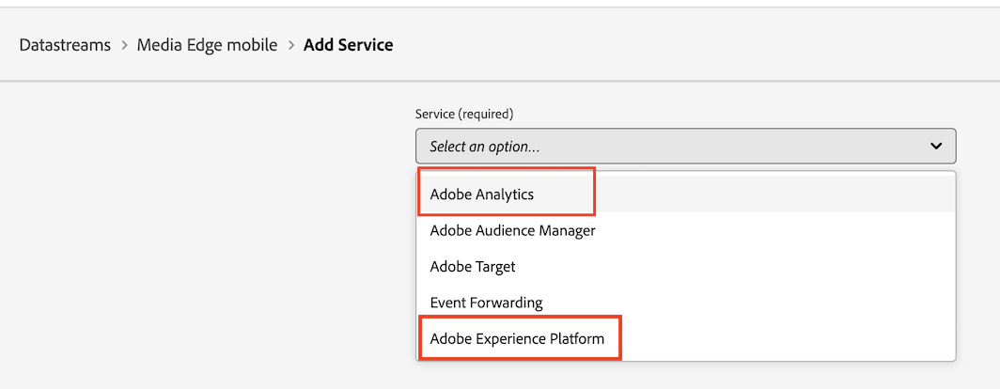

# Implementera Streaming Media Collection med Edge Network

Med Adobe Experience Platform Edge Network kan du skicka data till flera produkter på en central plats. Upplev att Edge vidarebefordrar lämplig information till de önskade produkterna. Med det här konceptet kan ni konsolidera implementeringsinsatser, särskilt genom att sprida flera datalösningar.

Följande bild visar hur Adobe Streaming Media Collection kan implementeras för att använda Experience Platform Edge för att göra data tillgängliga i Analysis Workspace, antingen i Adobe Analytics eller Customer Journey Analytics:

En översikt över alla implementeringsalternativ, inklusive implementeringsmetoder som inte använder Experience Platform Edge, finns i [Implementera direktuppspelningsmediesamlingen](/help/implementation/overview.md).

Oavsett om du använder Adobe Experience Platform Web SDK, Adobe Experience Platform Mobile SDK, Adobe Experience Platform Roku SDK eller API:t för att implementera Streaming Media Collection med Experience Edge måste du först slutföra följande avsnitt:

## Konfigurera schemat i Adobe Experience Platform

För att standardisera datainsamlingen för användning i olika program som utnyttjar Adobe Experience Platform har Adobe skapat den öppna och offentligt dokumenterade standarden Experience Data Model (XDM).

Så här skapar och konfigurerar du ett schema:

1. Börja skapa schemat enligt beskrivningen i [Skapa och redigera scheman i användargränssnittet](https://experienceleague.adobe.com/docs/experience-platform/xdm/ui/resources/schemas.html?lang=en) i Adobe Experience Platform.

1. Välj [!UICONTROL **Experience Event**] när du väljer basklass för schemat på sidan Schemainformation när du skapar schemat.

   

1. Välj [!UICONTROL **Nästa**].

1. Ange ett visningsnamn och en beskrivning för schemat och välj sedan [!UICONTROL **Slutför**].

1. I området [!UICONTROL **Disposition**] väljer du [!UICONTROL **Lägg till**] i avsnittet [!UICONTROL **Fältgrupper**] och sedan söker du efter och lägger till följande nya fältgrupper i schemat:
   * `End User ID Details`
   * `Implementation Details`
   * `MediaAnalytics Interaction Details`

   När du har lagt till fältgrupperna bör de visas i avsnittet [!UICONTROL **Fältgrupper**] enligt följande:

   

1. Välj [!UICONTROL **Spara**] om du vill spara ändringarna.

1. (Valfritt) Du kan dölja vissa fält som inte används av API:t för Media Edge. Om du döljer dessa fält blir schemat enklare att läsa och förstå, men det är inte nödvändigt. Dessa fält refererar endast till fälten i fältgruppen `MediaAnalytics Interaction Details`.

+++ Expandera här om du vill visa instruktioner för fält som du kan dölja.

   1. Markera fältet `Media Collection Details` i området [!UICONTROL **Struktur**] och välj sedan [!UICONTROL **Hantera relaterade fält**].

      

   1. Aktivera alternativet [!UICONTROL **Visa visningsnamn för fält**] och uppdatera sedan schemat enligt följande:

      * I fältet `Media Collection Details` > `Advertising Details` döljer du följande rapporteringsfält: `Ad Completed`, `Ad Started` och `Ad Time Played`.

      * I fältet `Media Collection Details` > `Advertising Pod Details` döljer du följande rapporteringsfält: `Ad Break ID`

      * I fältet `Media Collection Details` > `Chapter Details` döljer du följande rapporteringsfält: `Chapter Completed`, `Chapter ID`, `Chapter Started` och `Chapter Time Played`.

      * Dölj fältet `List Of States` i fältet `Media Collection Details`.

        

      * I fältet `Media Collection Details` > `List Of States End` och `Media Collection Details` > `List Of States Start` döljer du följande rapporteringsfält: `Player State Count`, `Player State Set` och `Player State Time`.

        

      * I fältet `Media Collection Details` > `Qoe Data Details` döljer du följande rapporteringsfält: `Average Bitrate`, `Average Bitrate Bucket`, `Bitrate Change Impacted Streams`, `Bitrate Changes`, `Buffer Impacted Streams`, `Buffer Events`, `Dropped Frame Impacted Streams`, `Drops Before Starts`, `Errors`, `External Error IDs`, `Error Impacted Streams`, `Media SDK Error IDs`, `Player SDK Error IDs`, `Stalling Impacted Streams`, `Stalling Events`, `Total Buffer Duration` och &lbrace;1 `Total Stalling Duration`.

      * I fältet `Media Collection Details` > `Session Details` döljer du följande rapporteringsfält: `10% Progress Marker`, `25% Progress Marker`, `50% Progress Marker`, `75% Progress Marker`, `95% Progress Marker`, `Ad Count`, `Average Minute Audience`, `Content Completes`, `Chapter Count`, `Content Starts`, `Content Time Spent`, `Estimated Streams`, `Federated Data`, `Media Segment Views`, `Media Downloaded Flag`, `Media Starts`, &lbrace;11 , `Media Session Server Timeout`, `Media Time Spent`, `Media Session ID`, `Pause Events`, `Pause Impacted Streams`, , `Pev3`, `Pccr`, `Total Pause Duration`, `Unique Time Played` och `Video Segment` .

   1. Välj [!UICONTROL **Bekräfta**] om du vill spara ändringarna.

   1. Aktivera alternativet [!UICONTROL **Visa visningsnamn för fält**] i området [!UICONTROL **Struktur**] och markera sedan fältet `List Of Media Collection Downloaded Content Events`.

   1. Välj [!UICONTROL **Hantera relaterade fält**] och uppdatera sedan schemat enligt följande:

      * I fältet `List Of Media Collection Downloaded Content Events` > `Media Details` > `Advertising Details` döljer du följande rapporteringsfält: `Ad Completed`, `Ad Started` och `Ad Time Played`.

      * I fältet `List Of Media Collection Downloaded Content Events` > `Media Details` > `Advertising Pod Details` döljer du följande rapporteringsfält: `Ad Break ID`

      * I fältet `List Of Media Collection Downloaded Content Events` > `Media Details` > `Chapter Details` döljer du följande rapporteringsfält: `Chapter Completed`, `Chapter ID`, `Chapter Started` och `Chapter Time Played`.

      * Dölj fältet `List Of States` i fältet `List Of Media Collection Downloaded Content Events` > `Media Details`.

      * Dölj följande rapporteringsfält i fälten `List Of Media Collection Downloaded Content Events` > `Media Details` > `List Of States End` och `Media Collection Details` > `List Of States Start`: `Player State Count`, `Player State Set` och `Player State Time`.

      * I fältet `List Of Media Collection Downloaded Content Events` > `Media Details` > `Qoe Data Details` döljer du följande rapporteringsfält: `Average Bitrate`, `Average Bitrate Bucket`, `Bitrate Change Impacted Streams`, `Bitrate Changes`, `Buffer Events`, `Buffer Impacted Streams`, `Drops Before Starts`, `Dropped Frame Impacted Streams`, `Error Impacted Streams`, `Errors`, `External Error IDs`, `Media SDK Error IDs`, `Player SDK Error IDs`, `Stalling Events`, `Stalling Impacted Streams`, &lbrace;11 `Total Buffer Duration` och `Total Stalling Duration`.

      * I fältet `List Of Media Collection Downloaded Content Events` > `Media Details` > `Session Details` döljer du följande rapporteringsfält: `10% Progress Marker`, `25% Progress Marker`, `50% Progress Marker`, `75% Progress Marker`, `95% Progress Marker`, `Ad Count`, `Average Minute Audience`, `Chapter Count`, `Content Completes`, `Content Starts`, `Content Time Spent`, `Estimated Streams`, `Federated Data`, `Media Downloaded Flag`, `Media Segment Views`, &lbrace;11 , `Media Session Server Timeout`, `Media Starts`, `Media Session ID`, `Media Time Spent`, `Pause Events`, , `Pause Impacted Streams`, `Pccr`, `Pev3`, `Total Pause Duration`, `Unique Time Played` och `Video Segment` .

      * Dölj fältet `Media Session ID` i fältet `List Of Media Collection Downloaded Content Events` > `Media Details`.

   1. Välj [!UICONTROL **Bekräfta**] om du vill spara ändringarna.

   1. Markera fältet `Media Reporting Details` i området [!UICONTROL **Struktur**] och välj [!UICONTROL **Hantera relaterade fält**].

   1. Aktivera alternativet [!UICONTROL **Visa visningsnamn för fält**] och uppdatera sedan schemat enligt följande:

      * Dölj följande fält i fältet `Media Reporting Details`: `Error Details`, `List Of States End`, `List of States Start` och `Media Session ID`.

   1. Välj [!UICONTROL **Bekräfta**] > [!UICONTROL **Spara**] om du vill spara ändringarna.

+++

1. (Valfritt) Du kan lägga till anpassade metadata i schemat. På så sätt kan du ta med ytterligare, användardefinierade metadata som kan anpassas efter särskilda behov eller sammanhang. Den här flexibiliteten är användbar i scenarier där befintliga scheman inte täcker de önskade datapunkterna. (Du kan också arbeta med anpassade metadata med Media Edge API:er. Mer information finns i [Skapa anpassade metadata med Media Edge API:er](https://developer.adobe.com/cja-apis/docs/endpoints/media-edge/custom-metadata/).)

+++ Expandera här om du vill visa instruktioner om hur du lägger till anpassade metadata i ditt schema.

   1. Leta reda på namnet på innehavaren av organisationen genom att välja [!UICONTROL **Kontoinformation**] > [!UICONTROL **Tilldelade organ**] > [!UICONTROL _**organisationsnamn**_] > [!UICONTROL **klientorganisation**].

      Dessa anpassade fält kommer att tas emot via den här sökvägen. (Till exempel klientnamn: _dcbl → sökväg till mittAnpassatFält: _dcbl.myCustomField.)

   1. Lägg till en anpassad fältgrupp i det definierade medieschemat.

      

   1. Lägg till anpassade fält som du vill spåra i fältgruppen.

      

   1. [Använd den sökväg som genererats ](https://experienceleague.adobe.com/en/docs/experience-platform/xdm/ui/fields/overview#type-specific-properties) för det anpassade fältet i din nyttolast för begäran.

      

+++

1. Fortsätt med [Skapa en datauppsättning i Adobe Experience Platform](#create-a-dataset-in-adobe-experience-platform).

## Skapa en datauppsättning i Adobe Experience Platform

1. Kontrollera att du har konfigurerat ett schema enligt beskrivningen i [Konfigurera schemat i Adobe Experience Platform](#set-up-the-schema-in-adobe-experience-platform).

1. Börja skapa datauppsättningen enligt beskrivningen i [Användargränssnittsguiden för datauppsättningar](https://experienceleague.adobe.com/docs/experience-platform/catalog/datasets/user-guide.html?lang=en#create) i Adobe Experience Platform.

   När du väljer ett schema för datauppsättningen väljer du det schema som du skapade tidigare, vilket beskrivs i [Konfigurera schemat i Adobe Experience Platform](#set-up-the-schema-in-adobe-experience-platform).

1. Fortsätt med [Konfigurera en datastam i Customer Journey Analytics](#configure-a-datastream-in-adobe-experience-platform).

## Konfigurera ett datastream i Adobe Experience Platform

1. Kontrollera att du har skapat en datauppsättning enligt beskrivningen i [Skapa en datauppsättning i Adobe Experience Platform](#create-a-dataset-in-adobe-experience-platform).

1. Skapa en ny datastream enligt beskrivningen i [Konfigurera en datastream](https://experienceleague.adobe.com/docs/experience-platform/edge/datastreams/configure.html?lang=en).

   När du skapar dataströmmen måste du göra följande konfigurationsval:

   * I fältet [!UICONTROL **Händelseschema**] när du skapar dataströmmen måste du markera schemat som du skapade i [Konfigurera schemat i Adobe Experience Platform](#set-up-the-schema-in-adobe-experience-platform). Välj [!UICONTROL **Spara**].

     >[!IMPORTANT]
     >
     >Välj inte [!UICONTROL **Spara och lägg till mappning**] eftersom det leder till mappningsfel för fältet Tidsstämpel.

     

   * Lägg till någon av följande tjänster i dataströmmen, beroende på om du använder Adobe Analytics eller Customer Journey Analytics:

      * [!UICONTROL **Adobe Analytics**] (om Adobe Analytics används)

        Om du använder Adobe Analytics måste du definiera en rapportsserie, enligt beskrivningen i [Skapa en rapportsvit](https://experienceleague.adobe.com/en/docs/analytics/admin/admin-tools/manage-report-suites/c-new-report-suite/t-create-a-report-suite).

      * [!UICONTROL **Adobe Experience Platform**] (om Customer Journey Analytics används)

     Mer information om hur du lägger till en tjänst i ett datastream finns i avsnittet&quot;Lägg till tjänster i ett datastream&quot; i [Konfigurera ett datastream](https://experienceleague.adobe.com/docs/experience-platform/edge/datastreams/configure.html?lang=en#view-details).

     

      * Expandera [!UICONTROL **Avancerade alternativ**] och aktivera sedan alternativet [!UICONTROL **Medieanalys**].

     

1. Du är nu redo att implementera [Media Edge API](/help/implementation/edge/implementation-edge-api.md) eller [Media Edge SDK](/help/implementation/edge/edge-mobile-sdk.md) för att börja samla in medieanalysdata.

   När du har samlat in data kan du [skapa en anslutning i Customer Journey Analytics](#create-a-connection-in-customer-journey-analytics).

## Skapa en anslutning i Customer Journey Analytics

>[!NOTE]
>
>Följande procedur krävs bara om du använder Customer Journey Analytics.

1. Kontrollera att du har skapat en datastream enligt beskrivningen i [Konfigurera en datastream i Customer Journey Analytics](#configure-a-datastream-in-adobe-experience-platform).

1. Skapa en anslutning enligt beskrivningen i [Skapa en anslutning](https://experienceleague.adobe.com/docs/analytics-platform/using/cja-connections/create-connection.html?lang=en) i Customer Journey Analytics.

   När du skapar anslutningen krävs följande konfigurationsalternativ för att implementera den direktuppspelande mediesamlingen:

   1. Markera den datauppsättning som du skapade tidigare, enligt beskrivningen i [Skapa en datauppsättning i Adobe Experience Platform](#create-a-dataset-in-adobe-experience-platform).

   1. Kontrollera att inställningen [!UICONTROL **Importera alla nya data**] är aktiverad.

1. Fortsätt med [Skapa en datavy i Customer Journey Analytics](#create-a-new-data-view-in-customer-journey-analytics).

## Skapa en datavy i Customer Journey Analytics

>[!NOTE]
>
>Följande procedur krävs bara om du använder Customer Journey Analytics.

1. Kontrollera att du har skapat en anslutning i Customer Journey Analytics enligt beskrivningen i [Skapa en anslutning i Customer Journey Analytics](#create-a-connection-in-customer-journey-analytics).

1. Skapa en datavy enligt beskrivningen i [Skapa eller redigera en datavy](https://experienceleague.adobe.com/docs/analytics-platform/using/cja-dataviews/create-dataview.html?lang=en) i kundreseanalyser.

   När du skapar datavyn krävs följande konfigurationsalternativ för att implementera den direktuppspelande mediesamlingen:

   1. I fältet [!UICONTROL **Anslutning**] väljer du den anslutning du skapade tidigare, enligt beskrivningen i [Skapa en anslutning i Customer Journey Analytics](#create-a-connection-in-customer-journey-analytics).

      Det kan ta upp till 15 minuter innan anslutningen som du skapade är tillgänglig att välja.

   1. I avsnittet [!UICONTROL **Schemafält**] på fliken [!UICONTROL **Komponenter**] söker du efter varje komponent i tabellerna nedan och drar den till panelen [!UICONTROL **Metrisk**]. Om det finns flera fält med samma namn använder du XDM-sökvägen för att se till att det är rätt fält.

      **Huvudinnehåll - Innehållsmått**

      | Komponentnamn | XDM-sökväg |
      |----------|---------|
      | Media börjar | mediaReporting.sessionDetails.isViewed |
      | Vyer för mediesegment | mediaReporting.sessionDetails.hasSegmentView |
      | Innehållet börjar | mediaReporting.sessionDetails.isPlayed |
      | Innehållet slutförs | mediaReporting.sessionDetails.isCompleted |
      | Innehållstid | mediaReporting.sessionDetails.timePlayed |
      | Medietid tillagd | mediaReporting.sessionDetails.totalTimePlayed |
      | Unik uppspelningstid | mediaReporting.sessionDetails.uniqueTimePlayed |
      | 10 % förloppsmärke | mediaReporting.sessionDetails.hasProgress10 |
      | Genomsnittlig målgrupp i minuter | mediaReporting.sessionDetails.averageMinuteAudience |

      **Kapitel och annonser - statistik för kapitel och annonser**

      | Komponentnamn | XDM-sökväg |
      |----------|---------|
      | Kapitel startat | mediaReporting.chapterDetails.isStarted |
      | Kapitel slutfört | mediaReporting.chapterDetails.isCompleted |
      | Kapiteltid spelad | mediaReporting.chapterDetails.timePlayed |
      | Ad Started | mediaReporting.advertisingDetails.isStarted |
      | Annonsen har slutförts | mediaReporting.advertisingDetails.isCompleted |
      | Annonstid | mediaReporting.advertisingDetails.timePlayed |

      **QoE - QoE-mått**

      | Komponentnamn | XDM-sökväg |
      |----------|---------|
      | Tid att starta | mediaReporting.qoeDataDetails.timeToStart |
      | Drops Before Starts | mediaReporting.qoeDataDetails.isDroppedBeforeStart |
      | Buffertpåverkade strömmar | mediaReporting.qoeDataDetails.hasBufferImpactedStreams |
      | Ändrade bithastighetsströmmar som påverkas | mediaReporting.qoeDataDetails.hasBitrateChangeImpactedStreams |
      | Bithastighetsändringar | mediaReporting.qoeDataDetails.bitrateChangeCount |
      | Genomsnittlig bithastighet | mediaReporting.qoeDataDetails.bitrateAverage |
      | Släppta bildrutor | mediaReporting.qoeDataDetails.droppedFrames |
      | Fel | mediaReporting.qoeDataDetails.errorCount |
      | Felpåverkade strömmar | mediaReporting.qoeDataDetails.hasErrorImpactedStreams |
      | Ignorerade bildrutepåverkade strömmar | mediaReporting.qoeDataDetails.hasDroppedFrameImpactedStreams |

      **Spelartillstånd - Mätvärden för spelartillstånd**

      | Komponentnamn | XDM-sökväg |
      |----------|---------|
      | Uppsättning med spelartillstånd | mediaReporting.states.isSet |
      | Antal spelartillstånd | mediaReporting.states.count |
      | Spelarlägestid | mediaReporting.states.time |

   1. Uppdatera etiketterna (i listrutan [!UICONTROL **Kontextetiketter**]) för komponenterna i följande tabell. Sök efter och dra komponenter som inte redan finns på mätpanelen till panelen.

      | Komponentnamn | Kontextetikett |
      |---------|----------|
      | Tidsgräns för mediessionsserver | Media: Sekunder sedan senaste samtalet |
      | Medietid tillagd | Media: Medietid tillagd |
      | Buffertvaraktighet totalt | Media: Total buffertvaraktighet |
      | Tid att starta | Media: Tid att starta |
      | Total pausvaraktighet | Media: Total paus |

   1. Om du vill lägga till uppdelningar i ditt Customer Journey Analytics-projekt lägger du till följande dimensioner på panelen [!UICONTROL **Dimensioner**]:

      | XDM-sökväg | Komponentnamn |
      |---------|----------|
      | mediaReporting.states.name | Spelarlägesnamn |
      | mediaReporting.sessionDetails.ID | ID för mediesession |

      Förutom dimensionerna i den här tabellen kan du lägga till andra dimensioner som du vill göra tillgängliga för att filtrera data efter i Customer Journey Analytics-projekt.

1. Välj [!UICONTROL **Spara och fortsätt**] > [!UICONTROL **Spara och avsluta**] för att spara ändringarna.

1. Fortsätt med [Skapa och konfigurera ett projekt i Customer Journey Analytics](#create-and-configure-a-project-in-customer-journey-analytics).

## Skapa och konfigurera ett projekt i Customer Journey Analytics

1. Se till att du har skapat en datavy i Customer Journey Analytics enligt beskrivningen i [Skapa en datavy i Customer Journey Analytics](#create-a-new-data-view-in-customer-journey-analytics).

1. I Customer Journey Analytics väljer du [!UICONTROL **Skapa projekt**] på fliken [!UICONTROL **Workspace**] i området [!UICONTROL **Projekt**].

1. Välj [!UICONTROL **Tomt projekt**] > [!UICONTROL **Skapa**].

1. I det nya projektet markerar du datavyn som du skapade tidigare.

   När du skapar paneler i ditt projekt kan du använda alla komponenter som du har lagt till i datavyn, enligt beskrivningen i [Skapa en datavy i Customer Journey Analytics](#create-a-new-data-view-in-customer-journey-analytics).

   Följande fyra paneler är exempel på paneler som du kan skapa:

   

   

   

   

1. Markera ikonen **Paneler** i den vänstra listen och dra sedan i panelen [!UICONTROL **Medievisningsprogram**] och panelen [!UICONTROL **Medieuppspelningstid**] .

   De två panelerna ska se ut så här:

   

   

1. (Villkorligt) Om du har lagt till anpassade metadata i schemat, enligt beskrivningen i steg 8 i [Konfigurera schemat i Adobe Experience Platform](#set-up-the-schema-in-adobe-experience-platform), måste du ange beständighet för anpassade fält, enligt beskrivningen i [Inställningar för beständiga komponenter](https://experienceleague.adobe.com/en/docs/analytics-platform/using/cja-dataviews/component-settings/persistence) i Customer Journey Analytics-handboken.

   När data kommer in i Customer Journey Analytics är dimensionerna för anpassat användar-ID tillgängliga.

   

   >[!NOTE]
   >
   >Om du konfigurerar Adobe Analytics som ett uppdataflöde för ditt datastream finns de anpassade metadata också i ContextData, med det namn som du anger i schemat (utan klientprefix, t.ex. myCustomField). Detta gör det möjligt att använda alla Adobe Analytics-funktioner som är tillgängliga för ContextData, till exempel [skapa en bearbetningsregel](https://experienceleague.adobe.com/en/docs/analytics/admin/admin-tools/manage-report-suites/edit-report-suite/report-suite-general/c-processing-rules/processing-rules).

1. Dela projektet enligt beskrivningen i [Dela projekt](https://experienceleague.adobe.com/docs/analytics-platform/using/cja-workspace/curate-share/share-projects.html?lang=en).

   >[!NOTE]
   >
   >   Om de användare du vill dela med inte är tillgängliga kontrollerar du att användarna har användar- och administratörsåtkomst till Customer Journey Analytics i Adobe Admin Console.

1. Fortsätt med [Skicka data till Experience Platform Edge](#send-data-to-experience-platform-edge).

## Skicka data till Experience Platform Edge

Beroende på vilken typ av data du vill skicka till Experience Platform Edge kan du använda någon av följande metoder:

### Webb: Använda Adobe Experience Platform Web SDK

* [Kom igång](https://developer.adobe.com/client-sdks/documentation/media-for-edge-network/)

* [Skicka webbdata till Edge med Adobe Experience Platform Web SDK](/help/implementation/edge/edge-web-sdk.md)

* [Migrera till Adobe Streaming Media för Edge Network-tillägg](https://developer.adobe.com/client-sdks/documentation/adobe-media-analytics/migration-guide/)

### Mobil: Använd Adobe Experience Platform Mobile SDK

Använd följande dokumentationsresurser för att slutföra implementeringen av både iOS och Android:

* [Kom igång](https://developer.adobe.com/client-sdks/documentation/media-for-edge-network/)

* [API-referens](https://developer.adobe.com/client-sdks/documentation/media-for-edge-network/api-reference/)

* [Migrera till Adobe Streaming Media för Edge Network-tillägg](https://developer.adobe.com/client-sdks/documentation/adobe-media-analytics/migration-guide/)

### Roku: Adobe Experience Platform Roku SDK

* [Kom igång](https://developer.adobe.com/client-sdks/documentation/media-for-edge-network/)

* [Adobe Experience Platform Roku SDK](https://github.com/adobe/aepsdk-roku/tree/main)

* [Migrera till Adobe Streaming Media för Edge Network-tillägg](https://developer.adobe.com/client-sdks/documentation/adobe-media-analytics/migration-guide/) <!-- is the information here also applicable for Roku? -->

### API: webb och andra

API:t är för närvarande det enda sättet att skicka webbdata till Experience Platform Edge.

API:t är också tillgängligt om du vill använda en anpassad implementering av Edge API:er.

Mer information om mediet-API:t för Edge finns i följande resurser:

* [Översikt över Edge-API för media](https://experienceleague.adobe.com/docs/experience-platform/edge-network-server-api/media-edge-apis/overview.html)

* [Komma igång med Edge-API för media](https://experienceleague.adobe.com/docs/experience-platform/edge-network-server-api/media-edge-apis/getting-started.html)

* [Felsökningsguide för Edge-API:t för media](https://experienceleague.adobe.com/docs/experience-platform/edge-network-server-api/media-edge-apis/troubleshooting.html)

* [Använda Open API-specifikationsfilen för Media Edge API:er](https://developer.adobe.com/data-collection-apis/docs/api/media-edge/)
