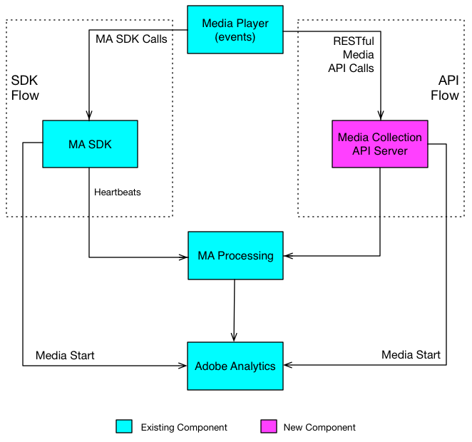

# Översikt över Media Collection API {#overview}

Media Collection API är ett Adobe RESTful-alternativ till Media SDK på klientsidan. Med Media Collection API kan spelaren spåra ljud- och videohändelser med RESTful HTTP-anrop.

Media Collection API är i princip ett kort som fungerar som en serverversion av Media SDK. Detta innebär att vissa aspekter av Media SDK-dokumentationen också är relevanta för Media Collection API. Båda lösningarna använder till exempel samma [parametrar för direktuppspelande media](../variables/audio-video-parameters.md), och de insamlade spårningsdata för direktuppspelande media leder till samma [rapportering och analys.](/help/reporting/media-reports-enable.md)

## Dataflöden för mediespårning {#media-tracking-data-flows}

En mediespelare som implementerar API:t för Media Collection gör RESTful API-spårningsanrop direkt till bakomliggande mediaspårningsserver, medan en spelare som implementerar Media SDK gör spårningsanrop till SDK API:er inuti spelarappen. En effekt av att anropa via webben är att spelaren som implementerar API:t för Media Collection måste hantera en del av bearbetningen som Media SDK hanterar automatiskt. (Information i [Implementering av mediesamling.](mc-api-impl/mc-api-quick-start.md))

Spårningsdata som hämtas med Media Collection API skickas och bearbetas först på ett annat sätt än spårningsdata som hämtas i en Media SDK-spelare, men samma bearbetningsmotor på baksidan används för båda lösningarna.



## API-översikt {#api-overview}

**URI:** Hämta detta från din Adobe-representant.

**HTTP-metod:** POST, med JSON-begärandebrödtext.

### API-anrop {#mc-api-calls}

* **`sessions`-** Upprättar en session med servern och returnerar ett sessions-ID som används i efterföljande `events` anrop. Din app anropar detta en gång i början av en spårningssession.

  `{uri}/api/v1/sessions`

* **`events`-** Skickar mediespårningsdata.

  `{uri}/api/v1/sessions/{session-id}/events`

### Begärandetext {#mc-api-request-body}

```json
{
    "playerTime": {
        "playhead": "{playhead position in seconds}",
        "ts": "{timestamp in milliseconds}"
    },
    "eventType": "{event-type}",
    "params": {
        "{parameter-name}": "{parameter-value}",
        "{parameter-name}": "{parameter-value}"
    },
    "qoeData" : {
        "{parameter-name}": "{parameter-value}",
        "{parameter-name}": "{parameter-value}"
    },
    "customMetadata": {
        "{parameter-name}": "{parameter-value}",
        "{parameter-name}": "{parameter-value}"
    }
}
```

* `playerTime` - Obligatoriskt för alla begäranden.
* `eventType` - Obligatoriskt för alla begäranden.
* `params` - Obligatoriskt för vissa `eventTypes`. Kontrollera [&#x200B; JSON-valideringsschemat &#x200B;](mc-api-ref/mc-api-json-validation.md) för att avgöra vilka eventTypes som är obligatoriska och vilka som är valfria.

* `qoeData` - Valfritt för alla begäranden.
* `customMetadata` - Valfritt för alla förfrågningar, men endast skickat med händelsetyperna `sessionStart`, `adStart` och `chapterStart`.

För varje `eventType` finns det ett öppet [&#x200B; JSON-valideringsschema &#x200B;](mc-api-ref/mc-api-json-validation.md) som du bör använda för att verifiera parametertyper och om en parameter är valfri eller nödvändig för en viss händelse.

### Händelsetyper {#mc-api-event-types}

* `sessionStart`
* `play`
* `ping`
* `pauseStart`
* `bufferStart`
* `adStart`
* `adComplete`
* `adSkip`
* `adBreakStart`
* `adBreakComplete`
* `chapterStart`
* `chapterSkip`
* `chapterComplete`
* `sessionEnd`
* `sessionComplete`
* `stateStart`
* `stateEnd`
