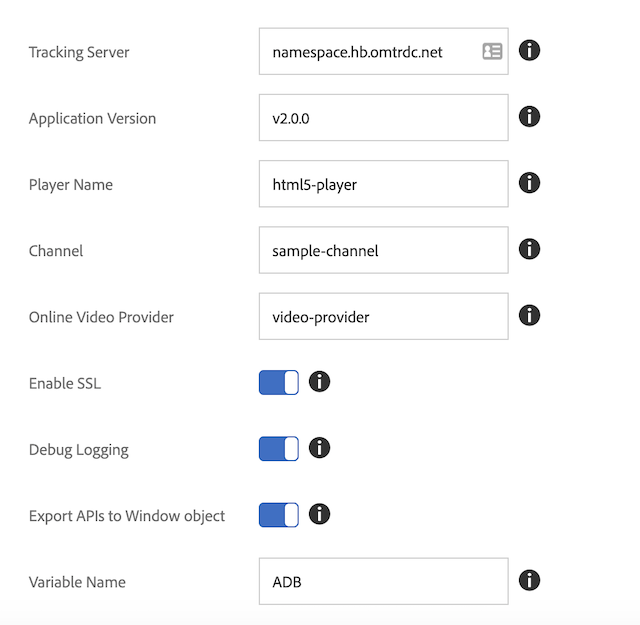

# Migrera från det fristående medie-SDK:t till Adobe Launch - webben (JS)

>[!NOTE]
>Adobe Experience Platform Launch har omklassificerats som en serie datainsamlingstekniker i Experience Platform. Som ett resultat av detta har flera terminologiska förändringar införts i produktdokumentationen. I följande [dokument](https://experienceleague.adobe.com/docs/experience-platform/tags/term-updates.html?lang=sv-SE) finns en konsoliderad referens till de ändrade terminologin.

## Skillnader i funktioner

* *Launch* - Launch ger dig ett användargränssnitt som hjälper dig att konfigurera, konfigurera och distribuera dina webbaserade mediespårningslösningar. Launch är bättre än Dynamic Tag Management (DTM).
* *Media SDK* - Media SDK ger dig mediespårningsbibliotek som är utformade för särskilda plattformar (t.ex. Android, iOS osv.). Adobe rekommenderar Media SDK för att spåra medieanvändning i dina mobilappar.

## Konfiguration

### Fristående media SDK

I det fristående Media SDK:t konfigurerar du spårningskonfigurationen i appen
och skicka det till SDK när du skapar spåraren.

```javascript
//Media Heartbeat initialization
var mediaConfig = new MediaHeartbeatConfig();
mediaConfig.trackingServer = "namespace.hb.omtrdc.net";
mediaConfig.playerName = "html5-player";
mediaConfig.channel = "sample-channel";
mediaConfig.ovp = "video-provider";
mediaConfig.appVersion = "v2.0.0"
mediaConfig.ssl = true;
mediaConfig.debugLogging = true;
```

Förutom konfigurationen för `MediaHeartbeat` måste sidan konfigurera och skicka
`AppMeasurement` -instansen och `VisitorAPI` -instansen för mediespårning i ordning
att fungera som det ska.

### Starta tillägg

1. Klicka på fliken [!UICONTROL Extensions] i Experience Platform Launch för
web-egenskap.
1. På fliken [!UICONTROL Catalog] letar du reda på Adobe Media Analytics for Audio och
Videotillägg och klicka på [!UICONTROL Install] .
1. Konfigurera spårningsparametrarna på sidan för tilläggsinställningar.
Media-tillägget använder de konfigurerade parametrarna för spårning.

   

[Starta användarhandboken - Installera och konfigurera medietillägget](https://experienceleague.adobe.com/docs/experience-platform/tags/extensions/adobe/media-analytics/overview.html?lang=sv-SE#install-and-configure-the-ma-extension)

## Skillnader mellan att skapa spårare

### Media SDK

1. Lägg till biblioteket Media Analytics i utvecklingsprojektet.
1. Skapa ett config-objekt (`MediaHeartbeatConfig`).
1. Implementera delegatprotokollet och visar funktionerna `getQoSObject()` och `getCurrentPlaybackTime()`.
1. Skapa en instans av pulsslag för media (`MediaHeartbeat`).

```
// Media Heartbeat initialization
var mediaConfig = new MediaHeartbeatConfig();
...
// Configuration settings
mediaConfig.trackingServer = Configuration.HEARTBEAT.TRACKING_SERVER;
...
// Implement Media Delegate (Quality of Service and Playhead)
var mediaDelegate = new MediaHeartbeatDelegate();
...
mediaDelegate.getQoSObject = function() {
    return MediaHeartbeat.createQoSObject(<bitrate>, <startuptime>, <fps>, <droppedFrames>);
    ...
}
...
// Create your tracker
this.mediaHeartbeat = new MediaHeartbeat(mediaDelegate, mediaConfig, appMeasurement);
```

### Starta

Launch erbjuder två sätt att skapa spårningsinfrastrukturen. Båda inriktningarna använder startalternativet för Media Analytics:

1. Använd API:erna för mediespårning från en webbsida.

   I det här scenariot exporterar Media Analytics-tillägget API:erna för mediespårning till en konfigurerad variabel i det globala fönsterobjektet:

   ```
   window["CONFIGURED_VARIABLE_NAME"].MediaHeartbeat.getInstance
   ```

1. Använd API:erna för mediespårning från ett annat Launch-tillägg.

   I det här scenariot använder du de API:er för mediespårning som visas av de delade modulerna `get-instance` och `media-heartbeat`.

   >[!NOTE]
   >
   >Delade moduler är inte tillgängliga för användning på webbsidor. Du kan bara använda delade moduler från ett annat tillägg.

   Skapa en `MediaHeartbeat`-instans med den `get-instance` delade modulen.
Skicka ett delegatobjekt till `get-instance` som visar `getQoSObject()`- och `getCurrentPlaybackTime()`-funktioner.

   ```
   var getMediaHeartbeatInstance =
   turbine.getSharedModule('adobe-video-analytics', 'get-instance');
   ```

   Få åtkomst till `MediaHeartbeat`-konstanter via den delade modulen `media-heartbeat`.

## Relaterad dokumentation

### Media SDK

* [Konfigurera JavaScript 2.x](/help/legacy/media-sdk/setup/setup-javascript/set-up-js-2.md)
* [Media SDK JS API](https://adobe-marketing-cloud.github.io/media-sdks/reference/javascript/MediaHeartbeat.html)

### Starta

* [Översikt över Launch](https://experienceleague.adobe.com/docs/experience-platform/tags/home.html?lang=sv-SE)
* [Media Analytics-tillägg](https://experienceleague.adobe.com/docs/experience-platform/tags/extensions/adobe/media-analytics/overview.html?lang=sv-SE)
