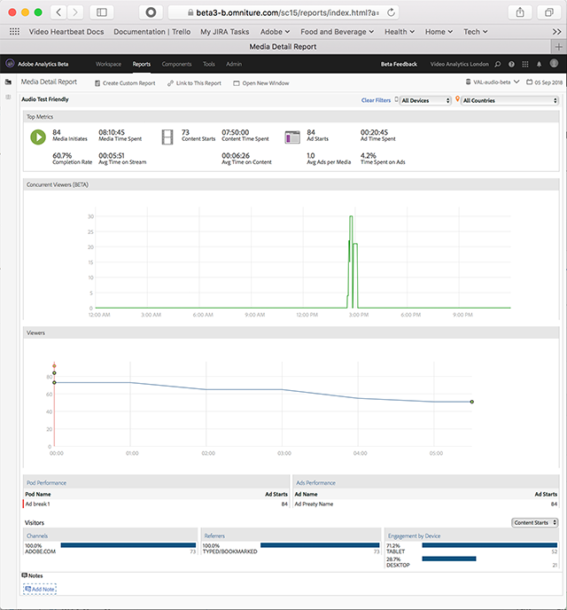

# Medieinformation{#media-detail}

På kontrollpanelen Medieinformation visas detaljerade mått för allt innehåll, inklusive samtidiga visningsprogram eller avlyssnare, innehållsstart, slutförandefrekvens, använd tid och annonsstart.

