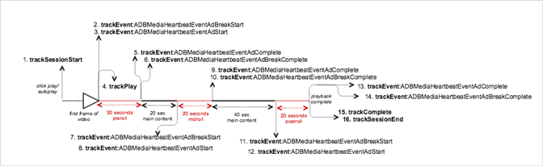

# VOD-uppspelning med inledande annonser{#vod-playback-with-pre-roll-ads}

I det här scenariot har annonser i förväg infogats före huvudinnehållet. Om inget annat anges är nätverksanropen samma som anropen i [VOD-uppspelningen utan annonser](/help/sdk-implement/tracking-scenarios/vod-no-intrs-details.md)-scenariot. Nätverksanropen sker samtidigt, men nyttolasten är annorlunda.

| Utlösare | Heartbeat-metod | Nätverksanrop   | Anteckningar   |
| --- | --- | --- | --- |
| Användaren klickar på [!UICONTROL Play] | `trackSessionStart` | Börja med Analytics-innehåll, starta pulsslagsinnehåll | Mätbiblioteket vet inte om det finns någon annons för pre-roll, så dessa nätverksanrop är fortfarande identiska med [VOD-uppspelningen utan annonser](/help/sdk-implement/tracking-scenarios/vod-no-intrs-details.md)-scenariot. |
| Annonsen börjar. | <ul> <li> `trackEvent:AdBreakStart` </li> <li> `trackEvent:AdStart` </li> </ul> | Start, pulsslag och start för annonsering i Analytics |  |
| Bildrutan i annons 1 spelas upp. | `trackPlay` | Heartbeat Ad Play | Annonsinnehållet spelas upp före huvudinnehållet och hjärtslagen börjar när annonsen börjar. |
| Annonsen spelas. |  | Ad Heartbeats |  |
| Annonsen nr 2 slutför uppspelningen. | `trackEvent:trackAdComplete` | Heartbeat Ad Complete | Slutet av annonsen nås. |
| Den första bildrutan i annons nr 2 spelas upp. | `trackEvent:AdStart` | Start, pulsslag och start för annonsering i Analytics |  |
| Annonen spelas. |  | Ad Heartbeats |  |
| Annonsen nr 2 slutför uppspelningen. | <ul> <li> `trackEvent:trackAdComplete` </li> <li> `trackEvent:AdBreakComplete` </li> </ul> | Heartbeat Ad Complete | Slutet av annonsen och poden nås. |
| Innehållet spelas upp. |  | Hjärtslag för innehåll | Detta nätverksanrop är identiskt med [VOD-uppspelningen utan annonser](/help/sdk-implement/tracking-scenarios/vod-no-intrs-details.md)-scenariot. |
| Innehållet är färdigt. | `trackComplete` | Hearsbeat-innehåll slutfört | Detta nätverksanrop är identiskt med [VOD-uppspelningen utan annonser](/help/sdk-implement/tracking-scenarios/vod-no-intrs-details.md)-scenariot. |
| Sessionen är över | `trackSessionEnd` |  | `SessionEnd` |

## Parametrar {#parameters}

När annonsuppspelningen börjar skickas ett `Heartbeat Ad Start`-anrop. Om annonsens början inte sammanfaller med 10-sekunderstimern fördröjs `Heartbeat Ad Start`-anropet med några sekunder och anropet går till nästa 10-sekundersintervall. När detta inträffar går en `Content Heartbeat` ut i samma intervall och du kan skilja mellan de två anropen genom att titta på händelsetypen och resurstypen:

### Heartbeat Ad Start

| Parameter | Värde | Anteckningar |
|---|---|---|
| `s:event:type` | `start` |  |
| `s:asset:type` | `ad` |  |

Annonserna följer samma grundmodell som `Content Heartbeats`, så anropet `Ad Play` liknar anropet `Content Play`.

### Heartbeat Ad Play-samtal

| Parameter | Värde | Anteckningar |
|---|---|---|
| `s:event:type` | `play` |  |
| `s:asset:type` | `ad` |  |

De här parametrarna liknar anropet `Content Heartbeats`, men anropet `Ad Heartbeats` innehåller några extra parametrar:

### Ad Heartbeats

| Parameter | Värde | Anteckningar |
|---|---|---|
| `s:event:type` | `play` |  |
| `s:asset:type` | `ad` |  |
| `s:asset:ad_id` | &lt;ad ID=&quot;&quot;> |  |
| `s:asset:pod_id` | &lt;ad pod=&quot;&quot; ID=&quot;&quot;> |  |

Liknar `Heartbeat Content Complete`-anrop, när annonsuppspelningen har slutförts och slutet av spelhuvudet nås, skickas ett `Heartbeat Ad Complete`-anrop. Det här samtalet ser ut som andra `Heartbeat Ad`-anrop men innehåller några specifika saker:

### Heartbeat Ad Complete Call

| Parameter | Värde | Anteckningar |
|---|---|---|
| `s:event:type` | `complete` |  |
| `s:asset:type` | `ad` |  |

## Exempelkod för en annonsbrytning före rullning {#sample-code-for-a-pre-roll-ad-break}

I det här scenariot består VOD av en pre-roll-annons, en andra pre-roll-annons, och därefter spelas innehållet upp.


* **** AndroidStäll in följande kod om du vill visa det här scenariot i Android:

   ```java
   // Set up  mediaObject 
   MediaObject mediaInfo = MediaHeartbeat.createMediaObject( 
       Configuration.MEDIA_NAME,  
       Configuration.MEDIA_ID,  
       Configuration.MEDIA_LENGTH,  
       MediaHeartbeat.StreamType.VOD 
   ); 
   
   HashMap<String, String> videoMetadata = new HashMap<String, String>(); 
   videoMetadata.put(CUSTOM_KEY_1, CUSTOM_VAL_1); 
   videoMetadata.put(CUSTOM_KEY_2, CUSTOM_VAL_2); 
   
   // 1. Call trackSessionStart() when the user clicks Play or if autoplay is used,  
   //    i.e., there's an intent to start playback.  
   _mediaHeartbeat.trackSessionStart(mediaInfo, videoMetadata); 
   
   ...... 
   ...... 
   
   // Pre-roll 
   MediaObject adBreakInfo =  
     MediaHeartbeat.createAdBreakObject(ADBREAK_NAME,  
                                        ADBREAK_POSITION,  
                                        ADBREAK_START_TIME); 
   MediaObject adInfo =  
     MediaHeartbeat.createAdObject(AD_NAME,  
                                   AD_ID,  
                                   AD_POSITION,  
                                   AD_LENGTH); 
   
   // Context ad data 
   HashMap<String, String> adMetadata = new HashMap<String, String>(); 
   adMetadata.put(CUSTOM_KEY_1, CUSTOM_VAL_1); 
   adMetadata.put(CUSTOM_KEY_2, CUSTOM_VAL_2); 
   
   // 2. Track the MediaHeartbeat.Event.AdBreakStart event when the pre-roll pod starts  
   //    to play. Note that since this is a pre-roll, call must track the 
   //    "MediaHeartbeat.Event.AdBreakStart" event before you call trackPlay().  
   _mediaHeartbeat.trackEvent(MediaHeartbeat.Event.AdBreakStart, adBreakInfo, null); 
   
   ....... 
   ....... 
   
   // 3. Track the MediaHeartbeat.Event.AdStart event when the pre-roll pod's ad starts  
   //    to play. Note that since this is a pre-roll, you must track the  
   //    "MediaHeartbeat.Event.AdStart" event before you call trackPlay(). 
   _mediaHeartbeat.trackEvent(MediaHeartbeat.Event.AdStart, adInfo, adMetadata); 
   
   ....... 
   ....... 
   
   // 4. Call trackPlay() when the playback actually starts, i.e., when the first frame  
   //    of the ad video is rendered on the screen. 
   _mediaHeartbeat.trackPlay(); 
   
   ....... 
   ....... 
   
   // 5. Track the MediaHeartbeat.Event.AdComplete event when the ad reaches the end,  
   //    i.e., when the ad completes and finishes playing.  
   _mediaHeartbeat.trackEvent(MediaHeartbeat.Event.AdComplete, null, null); 
   
   ....... 
   ....... 
   
   // 6. Track the MediaHeartbeat.Event.AdStart event when the pre-roll pod's second ad  
   //    starts to play. 
   _mediaHeartbeat.trackEvent(MediaHeartbeat.Event.AdStart, adInfo, adMetadata); 
   
   ....... 
   ....... 
   
   // 7. Track the MediaHeartbeat.Event.AdComplete event when the second ad reaches the  
   //    end, i.e., the second ad completes and finishes playing. 
   _mediaHeartbeat.trackEvent(MediaHeartbeat.Event.AdComplete, null, null); 
   
   ....... 
   ....... 
   
   // 8. Track the MediaHeartbeat.Event.AdBreakComplete event when all of the ads in the  
   //    pod finish playing.  
   _mediaHeartbeat.trackEvent(MediaHeartbeat.Event.AdBreakComplete, null, null); 
   
   ....... 
   ....... 
   
   // 9. Call trackComplete() when the playback reaches the end, i.e., when the video 
   //    completes and finishes playing. 
   _mediaHeartbeat.trackComplete(); 
   
   ........ 
   ........ 
   
   // 10. Call trackSessionEnd() when the playback session is over. This method must be  
   //     called even if the user does not watch the video to completion.  
   _mediaHeartbeat.trackSessionEnd(); 
   
   ........ 
   ........ 
   ```

* **iOS -** Ställ in följande kod om du vill visa det här scenariot i iOS:

   ```
   //  Set up mediaObject 
   ADBMediaObject *mediaObject =  
     [ADBMediaHeartbeat createMediaObjectWithName:MEDIA_NAME  
                        length:MEDIA_LENGTH  
                        streamType:ADBMediaHeartbeatStreamTypeVOD]; 
   
   NSMutableDictionary *videoContextData = [[NSMutableDictionary alloc] init]; 
   [videoContextData setObject:CUSTOM_VAL_1 forKey:CUSTOM_KEY_1]; 
   [videoContextData setObject:CUSTOM_VAL_2 forKey:CUSTOM_KEY_2]; 
   
   // 1. Call trackSessionStart when the user clicks Play or if autoplay is used,  
   //    i.e., there is an intent to start playback. 
   [_mediaHeartbeat trackSessionStart:mediaObject data:videoContextData]; 
   ....... 
   ....... 
   
   // Pre-roll 
   ADBMediaObject *adBreakInfo =  
     [ADBMediaHeartbeat createAdBreakObjectWithName:AD_BREAK_NAME  
                        position:AD_BREAK_POSITION  
                        startTime:AD_BREAK_START_TIME]; 
   ADBMediaObject *adInfo =  
     [ADBMediaHeartbeat createAdObjectWithName:AD_NAME  
                        adId:AD_ID  
                        position:AD_POSITION  
                        length:AD_LENGTH]; 
   
   // context ad data 
   NSMutableDictionary *adDictionary = [[NSMutableDictionary alloc] init]; 
   [adDictionary setObject:@"custom-val1" forKey:@"custom-key1"]; 
   [adDictionary setObject:@"custom-val2" forKey:@"custom-key2"]; 
   
   // 2. Track the ADBMediaHeartbeatEventAdBreakStart event when the pre-roll pod  
   //    starts to play. Note that since this is a pre-roll, you must track the  
   //    "ADBMediaHeartbeatEventAdBreakStart" event before you call trackPlay. 
   [_mediaHeartbeat trackEvent:ADBMediaHeartbeatEventAdBreakStart  
                    mediaObject:adBreakObject  
                    data:nil]; 
   ....... 
   ....... 
   
   // 3. Track the ADBMediaHeartbeatEventAdStart event when the pre-roll pod's  
   //    ad starts to play. Note that since this is a pre-roll, you must track  
   //    the "ADBMediaHeartbeatEventAdStart" event before you call trackPlay. 
   [_mediaHeartbeat trackEvent:ADBMediaHeartbeatEventAdStart  
                    mediaObject:adObject  
                    data:adDictionary]; 
   ....... 
   ....... 
   
   // 4. Call trackPlay when the playback actually starts, i.e., when the   
   //    first frame of the main content is rendered on the screen. 
   [_mediaHeartbeat trackPlay]; 
   ....... 
   ....... 
   
   // 5. Track the ADBMediaHeartbeatEventAdComplete event when the ad reaches  
   //    the end, i.e., when the video completes and finishes playing. 
   [_mediaHeartbeat trackEvent:ADBMediaHeartbeatEventAdComplete  
                    mediaObject:nil  
                    data:nil]; 
   ....... 
   ....... 
   
   // 6. Track the ADBMediaHeartbeatEventAdStart event when the pre-roll pod's  
   //    second ad starts to play. 
   [_mediaHeartbeat trackEvent:ADBMediaHeartbeatEventAdStart  
                    mediaObject:adBreakObject  
                    data:nil]; 
   ....... 
   ....... 
   
   // 7. Track the ADBMediaHeartbeatEventAdComplete event when the second ad  
   //    reaches the end, i.e., it completes and finishes playing. 
   [_mediaHeartbeat trackEvent:ADBMediaHeartbeatEventAdComplete  
                    mediaObject:nil  
                    data:nil]; 
   ....... 
   ....... 
   
   // 8. Track the ADBMediaHeartbeatEventAdBreakComplete event when all the  
   //    ads in the pod finish playing. 
   [_mediaHeartbeat trackEvent:ADBMediaHeartbeatEventAdBreakComplete  
                    mediaObject:adBreakObject  
                    data:nil]; 
   ....... 
   ....... 
   
   // 9. Call trackComplete when the playback reaches the end, i.e., when the  
   //    video completes and finishes playing. 
   [_mediaHeartbeat trackComplete]; 
   ....... 
   ....... 
   
   // 10. Call trackSessionEnd when the playback session is over. This method  
   //     must be called even if the user does not watch the video to completion. 
   [_mediaHeartbeat trackSessionEnd]; 
   ....... 
   ....... 
   ```

* **** JavaScriptOm du vill visa det här scenariot i JavaScript anger du följande text:

   ```js
   // Set up mediaObject 
   var mediaInfo =  
     MediaHeartbeat.createMediaObject(Configuration.MEDIA_NAME,  
                                      Configuration.MEDIA_ID,  
                                      Configuration.MEDIA_LENGTH,MediaHeartbeat.StreamType.VOD); 
   var videoMetadata = { 
       CUSTOM_KEY_1 : CUSTOM_VAL_1,  
       CUSTOM_KEY_2 : CUSTOM_VAL_2, 
       CUSTOM_KEY_3 : CUSTOM_VAL_3 
   }; 
   
   // 1. Call trackSessionStart() when Play is clicked or if autoplay is used,  
   //    i.e., there's an intent to start playback. 
   this._mediaHeartbeat.trackSessionStart(mediaInfo, videoMetadata); 
   
   ...... 
   ...... 
   
   // Preroll 
   var adBreakInfo =  
     MediaHeartbeat.createAdBreakObject(ADBREAK_NAME, ADBREAK_POSITION, ADBREAK_START_TIME); 
   var adInfo =  
     MediaHeartbeat.createAdObject(AD_NAME, AD_ID, AD_POSITION, AD_LENGTH); 
   
   // Custom ad metadata 
   var adMetadata = { 
       CUSTOM_AD_KEY_1 : CUSTOM_AD_VAL_1,  
       CUSTOM_AD_KEY_2 : CUSTOM_AD_VAL_2 
   }; 
   
   // 2. Track the MediaHeartbeat.Event.AdBreakStart event when the preroll pod starts to play.  
   //    Note that since this is a preroll, track the MediaHeartbeat.Event.AdBreakStart  
   //    event before you call trackPlay(). 
   this._mediaheartbeat.trackEvent(MediaHeartbeat.Event.AdBreakStart, adBreakInfo, null); 
   
   ....... 
   ....... 
   
   // 3. Track the MediaHeartbeat.Event.AdStart event when the preroll pod's ad starts to play.  
   //    Note that since this is a preroll, track the MediaHeartbeat.Event.AdStart event before  
   //    you call trackPlay(). 
   this._mediaheartbeat.trackEvent(MediaHeartbeat.Event.AdStart, adInfo, adMetadata); 
   
   ....... 
   ....... 
   
   // 4. Call trackPlay() when the playback actually starts, i.e., the first frame of the  
         main content is rendered on the screen.  
   this._mediaHeartbeat.trackPlay(); 
   
   ....... 
   ....... 
   
   // 5. Track event MediaHeartbeat.Event.AdComplete when the ad reaches the end,  
   //    i.e., when it completes and finishes playing. 
   this._mediaheartbeat.trackEvent(MediaHeartbeat.Event.AdComplete); 
   
   ....... 
   ....... 
   
   // 6. Track the MediaHeartbeat.Event.AdStart event when the preroll pod's second  
   //    ad starts to play. 
   this._mediaheartbeat.trackEvent(MediaHeartbeat.Event.AdStart, adInfo, adMetadata); 
   
   ....... 
   ....... 
   
   // 7. Track the MediaHeartbeat.Event.AdComplete event when the second ad reaches  
   //    the end, i.e., when it completes and finishes playing. 
   this._mediaheartbeat.trackEvent(MediaHeartbeat.Event.AdComplete); 
   
   ....... 
   ....... 
   
   // 8. Track the MediaHeartbeat.Event.AdBreakComplete event when all the ads  
   //    in the pod finish playing. 
   this._mediaheartbeat.trackEvent(MediaHeartbeat.Event.AdBreakComplete); 
   
   ....... 
   ....... 
   
   // 9. Call trackComplete() when the playback reaches the end, i.e., when it 
   //    completes and finishes playing.  
   this._mediaHeartbeat.trackComplete(); 
   
   // 10. Call trackSessionEnd() when the playback session is over. This method must  
   //     be called even if the user does not watch the video to completion. 
   this._mediaHeartbeat.trackSessionEnd(); 
   
   ....... 
   .......
   ```

## Exempelkod för flera annonsbrytningar {#sample-code-for-multiple-ad-breaks}

I det här scenariot spelas VOD-innehåll upp med en pre-roll-annons, innehållet, en annons i mellanrullen, innehållet och en post-roll-annons.



* **** AndroidStäll in följande kod om du vill visa det här scenariot i Android:

   ```java
   // Set up mediaObject 
   MediaObject mediaInfo = MediaHeartbeat.createMediaObject( 
       Configuration.MEDIA_NAME,  
       Configuration.MEDIA_ID,  
       Configuration.MEDIA_LENGTH,  
       MediaHeartbeat.StreamType.VOD 
   ); 
   
   HashMap<String, String> videoMetadata = new HashMap<String, String>(); 
   videoMetadata.put(CUSTOM_KEY_1, CUSTOM_VAL_1); 
   videoMetadata.put(CUSTOM_KEY_2, CUSTOM_VAL_2); 
   
   // 1. Call trackSessionStart() when the user clicks Play or if autoplay is used,  
   //   i.e., there's an intent to start playback. 
   _mediaHeartbeat.trackSessionStart(mediaInfo, videoMetadata); 
   
   ...... 
   ...... 
   
   // Pre-roll 
   MediaObject adBreakInfo =  
     MediaHeartbeat.createAdBreakObject(ADBREAK_NAME,  
                                        ADBREAK_POSITION,  
                                        ADBREAK_START_TIME); 
   MediaObject adInfo = MediaHeartbeat.createAdObject(AD_NAME,  
                                                      AD_ID,  
                                                      AD_POSITION,  
                                                      AD_LENGTH); 
   
   // Context ad data 
   HashMap<String, String> adMetadata = new HashMap<String, String>(); 
   adMetadata.put(CUSTOM_KEY_1, CUSTOM_VAL_1); 
   adMetadata.put(CUSTOM_KEY_2, CUSTOM_VAL_2); 
   
   // 2. Track the MediaHeartbeat.Event.AdBreakStart event when the pre-roll pod  
   //    starts to play. Note that since this is a pre-roll, you must track the  
   //    "MediaHeartbeat.Event.AdBreakStart" event before you call trackPlay().  
   _mediaHeartbeat.trackEvent(MediaHeartbeat.Event.AdBreakStart, adBreakInfo, null); 
   
   ....... 
   ....... 
   
   // 3. Track the MediaHeartbeat.Event.AdStart event when the pre-roll pod's ad  
   //    starts to play. Note that since this is a pre-roll, you must track the  
   //    "MediaHeartbeat.Event.AdStart" event before you call trackPlay().  
   _mediaHeartbeat.trackEvent(MediaHeartbeat.Event.AdStart, adInfo, adMetadata); 
   
   ....... 
   ....... 
   
   // 4. Call trackPlay() when the playback actually starts, i.e., when the first  
   //    frame of the main content is rendered on the screen.  
   _mediaHeartbeat.trackPlay(); 
   
   ....... 
   ....... 
   
   // 5. Track the MediaHeartbeat.Event.AdComplete event when the ad reaches the end,  
   //    i.e., when the ad completes and finishes playing.  
   _mediaHeartbeat.trackEvent(MediaHeartbeat.Event.AdComplete, null, null); 
   
   ....... 
   ....... 
   
   // 6. Track the MediaHeartbeat.Event.AdBreakComplete event when all of the ads in  
   //;    the pod finish playing. 
   _mediaHeartbeat.trackEvent(MediaHeartbeat.Event.AdBreakComplete, null, null); 
   
   ....... 
   ....... 
   
   // Mid-roll 
   MediaObject adBreakInfo =  
     MediaHeartbeat.createAdBreakObject(mid-roll_BREAK_NAME,  
                                        mid-roll_BREAK_POSITION,  
                                        mid-roll_BREAK_START_TIME); 
   MediaObject adInfo =  
     MediaHeartbeat.createAdObject(mid-roll_AD_NAME,  
                                   mid-roll_AD_ID,  
                                   mid-roll_AD_POSITION,  
                                   mid-roll_AD_LENGTH); 
   
   // Context ad data 
   HashMap<String, String> adMetadata = new HashMap<String, String>(); 
   adMetadata.put(CUSTOM_KEY_1, CUSTOM_VAL_1); 
   adMetadata.put(CUSTOM_KEY_2, CUSTOM_VAL_2); 
   
   // 7. Track the MediaHeartbeat.Event.AdBreakStart event when the mid-roll pod  
   //    starts to play.  
   _mediaHeartbeat.trackEvent(MediaHeartbeat.Event.AdBreakStart, adBreakInfo, null); 
   
   ....... 
   ....... 
   
   // 8. Track the MediaHeartbeat.Event.AdStart event when the mid-roll pod's ad  
   //    starts to play.  
   _mediaHeartbeat.trackEvent(MediaHeartbeat.Event.AdStart, adInfo, adMetadata); 
   
   ....... 
   ....... 
   
   // 9. Track the MediaHeartbeat.Event.AdComplete event when the ad reaches the end,  
   //    i.e., when the adcompletes and finishes playing.  
   _mediaHeartbeat.trackEvent(MediaHeartbeat.Event.AdComplete, null, null); 
   
   ....... 
   ....... 
   
   // 10. Track the MediaHeartbeat.Event.AdBreakComplete event when all the ads in the  
   //      mid-roll pod finish playing.  
   _mediaHeartbeat.trackEvent(MediaHeartbeat.Event.AdBreakComplete, null, null); 
   
   ....... 
   ....... 
   
   // Post-roll 
   MediaObject adBreakInfo =  
     MediaHeartbeat.createAdBreakObject(POSTROLL_BREAK_NAME,  
                                        POSTROLL_BREAK_POSITION,  
                                        POSTROLL_BREAK_START_TIME); 
   MediaObject adInfo =  
     MediaHeartbeat.createAdObject(POSTROLL_AD_NAME,  
                                   POSTROLL_AD_ID,  
                                   POSTROLL_AD_POSITION,  
                                   POSTROLL_AD_LENGTH); 
   
   // Context ad data 
   HashMap<String, String> adMetadata = new HashMap<String, String>(); 
   adMetadata.put(CUSTOM_KEY_1, CUSTOM_VAL_1); 
   adMetadata.put(CUSTOM_KEY_2, CUSTOM_VAL_2); 
   
   // 11. Track the MediaHeartbeat.Event.AdBreakStart event when the post-roll pod  
   //     starts to play.  
   _mediaHeartbeat.trackEvent(MediaHeartbeat.Event.AdBreakStart, adBreakInfo, null); 
   
   ....... 
   ....... 
   
   // 12. Track the MediaHeartbeat.Event.AdStart event when the post-roll pod's  
   //     ad starts to play.  
   _mediaHeartbeat.trackEvent(MediaHeartbeat.Event.AdStart, adInfo, adMetadata); 
   
   ....... 
   ....... 
   
   // 13. Track the MediaHeartbeat.Event.AdComplete event when the ad reaches the  
   //     end, i.e., when the ad completes and finishes playing. 
   _mediaHeartbeat.trackEvent(MediaHeartbeat.Event.AdComplete, null, null); 
   
   ....... 
   ....... 
   
   // 14. Track the MediaHeartbeat.Event.AdBreakComplete event when all the ads in  
   //     the post-roll pod finish playing.  
   _mediaHeartbeat.trackEvent(MediaHeartbeat.Event.AdBreakComplete, null, null); 
   
   ....... 
   ....... 
   
   // 15. Call trackComplete() when the playback reaches the end, i.e., when the 
   //     video completes and finishes playing. 
   _mediaHeartbeat.trackComplete(); 
   
   ........ 
   ........ 
   
   // 16. Call trackSessionEnd() when the playback session is over. This method  
   //     must be called even if the user does not watch the video to completion.  
   _mediaHeartbeat.trackSessionEnd(); 
   
   ........ 
   ........ 
   ```

* **Ställ in följande kod för att** iOST ska kunna visa det här scenariot i iOS:

   ```
   //  Set up mediaObject 
   ADBMediaObject *mediaObject =  
     [ADBMediaHeartbeat createMediaObjectWithName:MEDIA_NAME  
                        length:MEDIA_LENGTH  
                        streamType:ADBMediaHeartbeatStreamTypeVOD]; 
   
   NSMutableDictionary *videoContextData =  
     [[NSMutableDictionary alloc] init]; 
   [videoContextData setObject:CUSTOM_VAL_1 forKey:CUSTOM_KEY_1]; 
   [videoContextData setObject:CUSTOM_VAL_2 forKey:CUSTOM_KEY_2]; 
   
   // 1. Call trackSessionStart when the user clicks Play or if autoplay is used,  
   //    i.e., there is an intent to start playback. 
   [_mediaHeartbeat trackSessionStart:mediaObject data:videoContextData]; 
   ....... 
   ....... 
   
   // Pre-roll 
   ADBMediaObject *adBreakInfo =  
     [ADBMediaHeartbeat createAdBreakObjectWithName:AD_BREAK_NAME  
                        position:AD_BREAK_POSITION  
                        startTime:AD_BREAK_START_TIME]; 
   ADBMediaObject *adInfo =  
     [ADBMediaHeartbeat createAdObjectWithName:AD_NAME  
                        adId:AD_ID  
                        position:AD_POSITION  
                        length:AD_LENGTH]; 
   
   // Context ad data 
   NSMutableDictionary *adDictionary =  
     [[NSMutableDictionary alloc] init]; 
   [adDictionary setObject:@"custom-val1" forKey:@"custom-key1"]; 
   [adDictionary setObject:@"custom-val2" forKey:@"custom-key2"]; 
   
   // 2. Track the ADBMediaHeartbeatEventAdBreakStart event when the  
   //    pre-roll pod starts to play. Note that since this is a pre-roll,  
   //    you must track the ADBMediaHeartbeatEventAdBreakStart event  
   //    before you call trackPlay. 
   [_mediaHeartbeat trackEvent:ADBMediaHeartbeatEventAdBreakStart  
                    mediaObject:adBreakObject  
                    data:adDictionary]; 
   ....... 
   ....... 
   
   // 3. Track the ADBMediaHeartbeatEventAdStart when the pre-roll  
   //    pod's ad starts to play. Note that since this is a pre-roll,  
   //    you must track the ADBMediaHeartbeatEventAdStart before you 
   //    call trackPlay. 
   [_mediaHeartbeat trackEvent:ADBMediaHeartbeatEventAdStart  
                     mediaObject:adObject  
                     data:adDictionary]; 
   ....... 
   ....... 
   
   // 4. Call trackPlay when the playback actually starts, i.e., when 
   //    the first frame of the main content is rendered on the screen. 
   [_mediaHeartbeat trackPlay]; 
   ....... 
   ....... 
   
   // 5. Track the ADBMediaHeartbeatEventAdComplete event when the ad  
   //    reaches the end, i.e., when it completes and finishes playing. 
   [_mediaHeartbeat trackEvent:ADBMediaHeartbeatEventAdComplete  
                     mediaObject:nil  
                     data:nil]; 
   ....... 
   ....... 
   
   // 6. Track the ADBMediaHeartbeatEventAdBreakComplete event when all  
   //    of the ads in the pod finish playing. 
   [_mediaHeartbeat trackEvent:ADBMediaHeartbeatEventAdBreakComplete  
                     mediaObject:nil  
                     data:nil]; 
   ....... 
   ....... 
   
   // Mid-roll 
   ADBMediaObject *adBreakInfo =  
     [ADBMediaHeartbeat createAdBreakObjectWithName:MIDROLL_BREAK_NAME  
                        position:MIDROLL_BREAK_POSITION  
                        startTime:MIDROLL_BREAK_START_TIME]; 
   ADBMediaObject *adInfo =  
     [ADBMediaHeartbeat createAdObjectWithName:MIDROLL_AD_NAME  
                        adId:MIDROLL_AD_ID position:MIDROLL_AD_POSITION  
                        length:MIDROLL_AD_LENGTH]; 
   
   // context ad data 
   NSMutableDictionary *midrollAdDictionary = [[NSMutableDictionary alloc] init]; 
   [midrollAdDictionary setObject:@"custom-val1" forKey:@"custom-key1"]; 
   [midrollAdDictionary setObject:@"custom-val2" forKey:@"custom-key2"]; 
   
   // 7. Track the ADBMediaHeartbeatEventAdBreakStart event when the mid-roll pod  
   //    starts to play. 
   [_mediaHeartbeat trackEvent:ADBMediaHeartbeatEventAdBreakStart  
                     mediaObject:adBreakObject  
                     data:nil]; 
   ....... 
   ....... 
   
   // 8. Track the ADBMediaHeartbeatEventAdStart event when the mid-roll pod's  
   //    ad starts to play. 
   [_mediaHeartbeat trackEvent:ADBMediaHeartbeatEventAdStart  
                    mediaObject:adObject  
                    data:midrollAdDictionary]; 
   ....... 
   ....... 
   
   // 9. Track the ADBMediaHeartbeatEventAdComplete event when the ad reaches  
   //    the end, i.e., when it completes and finishes playing. 
   [_mediaHeartbeat trackEvent:ADBMediaHeartbeatEventAdComplete  
                    mediaObject:nil  
                    data:nil]; 
   ....... 
   ....... 
   
   // 10. Track the ADBMediaHeartbeatEventAdBreakComplete event when all the  
   //     ads in the mid-roll pod finish playing. 
   [_mediaHeartbeat trackEvent:ADBMediaHeartbeatEventAdBreakComplete  
                    mediaObject:nil  
                    data:nil]; 
   ....... 
   ....... 
   
   // Post-roll 
   ADBMediaObject *postrollBreakInfo =  
     [ADBMediaHeartbeat createAdBreakObjectWithName:POSTROLL_BREAK_NAME  
                        position:POSTROLL_BREAK_POSITION  
                        startTime:POSTROLL_BREAK_START_TIME]; 
   ADBMediaObject *adInfo =  
     [ADBMediaHeartbeat createAdObjectWithName:POSTROLL_AD_NAME  
                        adId:POSTROLL_AD_ID  
                        position:POSTROLL_AD_POSITION  
                        length:POSTROLL_AD_LENGTH]; 
   
   // Context ad data 
   NSMutableDictionary *postrollAdDictionary =  
     [[NSMutableDictionary alloc] init]; 
   [postrollAdDictionary setObject:@"custom-val1" forKey:@"custom-key1"]; 
   [postrollAdDictionary setObject:@"custom-val2" forKey:@"custom-key2"]; 
   
   // 11. Track the ADBMediaHeartbeatEventAdBreakStart event when the  
   //     post-roll pod starts to play. 
   [_mediaHeartbeat trackEvent:ADBMediaHeartbeatEventAdBreakStart  
                    mediaObject:adBreakObject  
                    data:nil]; 
   ....... 
   ....... 
   
   // 12. Track the ADBMediaHeartbeatEventAdStart event when the  
   //     post-roll pod's ad starts to play. 
   [_mediaHeartbeat trackEvent:ADBMediaHeartbeatEventAdStart  
                    mediaObject:adObject  
                    data:postrollAdDictionary]; 
   ....... 
   ....... 
   
   // 13. Track the ADBMediaHeartbeatEventAdComplete event when the  
   //     post-roll pod's ad finishes playing. 
   [_mediaHeartbeat trackEvent:ADBMediaHeartbeatEventAdComplete  
                    mediaObject:nil  
                    data:nil]; 
   ....... 
   ....... 
   
   // 14. Track the ADBMediaHeartbeatEventAdBreakComplete event when  
   //     all the ads in the post-roll pod finish playing. 
   [_mediaHeartbeat trackEvent:ADBMediaHeartbeatEventAdBreakComplete  
                    mediaObject:nil data:nil]; 
   ....... 
   ....... 
   
   // 15. Call trackComplete when the playback reaches the end,  
   //     i.e., when the video completes and finishes playing. 
   [_mediaHeartbeat trackComplete]; 
   ....... 
   ....... 
   
   // 16. Call trackSessionEnd when the playback session is over. This method  
   //     must be called even if the user does not watch the video to completion. 
   [_mediaHeartbeat trackSessionEnd]; 
   ....... 
   ....... 
   ```

* **** JavaScriptOm du vill visa det här scenariot i JavaScript anger du följande text:

   ```js
   // Set up mediaObject 
   MediaObject mediaInfo = MediaHeartbeat.createMediaObject( 
       Configuration.MEDIA_NAME,  
       Configuration.MEDIA_ID,  
       Configuration.MEDIA_LENGTH,  
       MediaHeartbeat.StreamType.VOD 
   ); 
   
   var videoMetadata = { 
       CUSTOM_KEY_1 : CUSTOM_VAL_1,  
       CUSTOM_KEY_2 : CUSTOM_VAL_2,  
       CUSTOM_KEY_3 : CUSTOM_VAL_ 
   }; 
   
   // 1. Call trackSessionStart() when Play is clicked or if autoplay is used,  
   //    i.e., when there's an intent to start playback.  
   this._mediaHeartbeat.trackSessionStart(mediaInfo, videoMetadata); 
   
   ...... 
   ...... 
   
   // Preroll 
   var adBreakInfo =  
     MediaHeartbeat.createAdBreakObject(ADBREAK_NAME,  
                                        ADBREAK_POSITION,  
                                        ADBREAK_START_TIME); 
   var adInfo =  
     MediaHeartbeat.createAdObject(AD_NAME,  
                                   AD_ID,  
                                   AD_POSITION,  
                                   AD_LENGTH); 
   
   // Custom ad metadata 
   var adMetadata = { 
       CUSTOM_KEY_1 : CUSTOM_VAL_1,  
       CUSTOM_KEY_2 : CUSTOM_VAL_2 
   
   }; 
   
   // 2. Track the MediaHeartbeat.Event.AdBreakStart event when the preroll pod  
   //    starts to play. Note that since this is a preroll, you must track the  
   //    MediaHeartbeat.Event.AdBreakStart event before you call trackPlay().  
   this._trackEvent(MediaHeartbeat.Event.AdBreakStart, adBreakInfo, null); 
   
   ....... 
   ....... 
   
   // 3. Track the MediaHeartbeat.Event.AdStart event when the preroll pod's ad  
   //    starts to play. Note that since this is a preroll, you must track the 
   //    MediaHeartbeat.Event.AdStart event before you call trackPlay().  
   this._heartbeat.trackEvent(MediaHeartbeat.Event.AdStart, adInfo, adMetadata); 
   
   ....... 
   ....... 
   
   // 4. Call trackPlay() when the main content actually starts, i.e., when the  
   //    first frame of the video content is rendered on the screen.  
   this._mediaHeartbeat.trackPlay(); 
   
   ....... 
   ....... 
   
   // 5. Track the MediaHeartbeat.Event.AdComplete event when the ad reaches the end,  
   //    i.e., when the ad completes and finishes playing. 
   this._heartbeat.trackEvent(MediaHeartbeat.Event.AdComplete, null, null); 
   
   ....... 
   ....... 
   
   // 6. Track the MediaHeartbeat.Event.AdBreakComplete event when all of the ads in  
   //    the pod finish playing. 
   this._mediaHeartbeat.trackEvent(MediaHeartbeat.Event.AdBreakComplete); 
   
   ....... 
   ....... 
   
   // Midroll 
   var adBreakInfo =  
     MediaHeartbeat.createAdBreakObject(MIDROLL_BREAK_NAME,  
                                        MIDROLL_BREAK_POSITION,  
                                        MIDROLL_BREAK_START_TIME); 
   var adInfo =  
     MediaHeartbeat.createAdObject(MIDROLL_AD_NAME,  
                                   MIDROLL_AD_ID, 
                                   MIDROLL_AD_POSITION,  
                                   MIDROLL_AD_LENGTH); 
   
   // Custom ad metadata 
   var adMetadata = { 
       CUSTOM_KEY_1 : CUSTOM_VAL_1,  
       CUSTOM_KEY_2 : CUSTOM_VAL_2 
   
   }; 
   
   // 7. Track the MediaHeartbeat.Event.AdBreakStart event when the  
   //    midroll pod starts to play. 
   this._mediaHeartbeat.trackEvent(MediaHeartbeat.Event.AdBreakStart, adBreakInfo); 
   
   ....... 
   ....... 
   
   // 8. Track the MediaHeartbeat.Event.AdStart event when the midroll  
   //    pod's ad starts to play. 
   this._mediaHeartbeat.trackEvent(MediaHeartbeat.Event.AdStart,  
                                   adInfo,  
                                   adMetadata); 
   
   ....... 
   ....... 
   
   // 9. Track the MediaHeartbeat.Event.AdComplete event when the ad  
   //    reaches the end, i.e., when the ad completes and finishes playing.  
   this._mediaHeartbeat.trackEvent(MediaHeartbeat.Event.AdComplete); 
   
   ....... 
   ....... 
   
   // 10. Track the MediaHeartbeat.Event.AdBreakComplete event when all of  
   //     the ads in the midroll pod finish playing. 
   this._mediaHeartbeat.trackEvent(MediaHeartbeat.Event.AdBreakComplete); 
   
   ....... 
   ....... 
   
   // Set up mediaObject 
   var mediaInfo = MediaHeartbeat.createMediaObject( 
       Configuration.MEDIA_NAME,  
       Configuration.MEDIA_ID,  
       Configuration.MEDIA_LENGTH,  
       MediaHeartbeat.StreamType.VOD 
   
   ); 
   
   var videoMetadata = { 
       CUSTOM_KEY_1 : CUSTOM_VAL_1,  
       CUSTOM_KEY_2 : CUSTOM_VAL_2,  
       CUSTOM_KEY_3 : CUSTOM_VAL_3 
   
   }; 
   
   // 1. Call trackSessionStart() when Play is clicked or if autoplay  
   //    is used, i.e., when there's an intent to start playback. 
   this._mediaHeartbeat.trackSessionStart(mediaInfo, videoMetadata); 
   
   ...... 
   ...... 
   
   // Preroll 
   var adBreakInfo =  
     MediaHeartbeat.createAdBreakObject(ADBREAK_NAME,  
                                        ADBREAK_POSITION,  
                                        ADBREAK_START_TIME); 
   var adInfo =  
     MediaHeartbeat.createAdObject(AD_NAME,  
                                   AD_ID,  
                                   AD_POSITION,  
                                   AD_LENGTH); 
   
   // Custom ad metadata 
   var adMetadata = { 
      CUSTOM_KEY_1 : CUSTOM_VAL_1,  
      CUSTOM_KEY_2 : CUSTOM_VAL_2 
   
   }; 
   
   // 2. Track the MediaHeartbeat.Event.AdBreakStart event when the preroll pod  
   //    starts to play. Note that since this is a preroll, you must track the   
   //    MediaHeartbeat.Event.AdBreakStart event before you call trackPlay(). 
   this._mediaHeartbeat.trackEvent(MediaHeartbeat.Event.AdBreakStart, adBreakInfo); 
   
   ....... 
   ....... 
   
   // 3. Track the MediaHeartbeat.Event.AdStart event when the preroll pod's  
   //    ad starts to play. Note that since this is a preroll, you must track   
   //    the MediaHeartbeat.Event.AdStart event before you call trackPlay(). 
   this._mediaHeartbeat.trackEvent(MediaHeartbeat.Event.AdStart, adInfo, adMetadata); 
   
   ....... 
   ....... 
   
   // 4. Call trackPlay() when the playback actually starts, i.e., when the first  
   //    frame of the main content is rendered on the screen.  
   _mediaHeartbeat.trackPlay(); 
   
   ....... 
   ....... 
   
   // 5. Track the MediaHeartbeat.Event.AdComplete event when the ad reaches  
   //    the end, i.e., when the ad completes and finishes playing. 
   this._mediaHeartbeat.trackEvent(MediaHeartbeat.Event.AdComplete); 
   
   ....... 
   ....... 
   
   // 6. Track the MediaHeartbeat.Event.AdBreakComplete event when all  
   //    of the ads in the pod finish playing. 
   this._mediaHeartbeat.trackEvent(MediaHeartbeat.Event.AdBreakComplete); 
   
   ....... 
   ....... 
   
   // Mid-roll 
   var adBreakInfo =  
     MediaHeartbeat.createAdBreakObject(MIDROLL_BREAK_NAME, 
                                        MIDROLL_BREAK_POSITION,  
                                        MIDROLL_BREAK_START_TIME); 
   var adInfo =  
     MediaHeartbeat.createAdObject(MIDROLL_AD_NAME,  
                                   MIDROLL_AD_ID,  
                                   MIDROLL_AD_POSITION,  
                                   MIDROLL_AD_LENGTH); 
   
   // Custom ad metadata 
   var adMetadata = { 
      CUSTOM_KEY_1 : CUSTOM_VAL_1,  
      CUSTOM_KEY_2 : CUSTOM_VAL_2 
   
   }; 
   
   // 7. Track the MediaHeartbeat.Event.AdBreakStart event when the midroll  
   //    pod starts to play. 
   this._mediaHeartbeat.trackEvent(MediaHeartbeat.Event.AdBreakStart, adBreakInfo); 
   
   ....... 
   ....... 
   
   // 8. Track the MediaHeartbeat.Event.AdStart event when the midroll pod's  
   //    ad starts to play. 
   this._mediaHeartbeat.trackEvent(MediaHeartbeat.Event.AdStart, adInfo, adMetadata); 
   
   ....... 
   ....... 
   
   // 9. Track the MediaHeartbeat.Event.AdComplete event when the ad reaches  
   //    the end, i.e., when the ad completes and finishes playing. 
   this._mediaHeartbeat.trackEvent(MediaHeartbeat.Event.AdComplete); 
   
   ....... 
   ....... 
   
   // 10. Track the MediaHeartbeat.Event.AdBreakComplete event when all  
   //     of the ads in the midroll pod finish playing. 
   this._mediaHeartbeat.trackEvent(MediaHeartbeat.Event.AdBreakComplete); 
   
   ....... 
   ....... 
   
   // Postroll 
   var adBreakInfo = MediaHeartbeat.createAdBreakObject(POSTROLL_BREAK_NAME,  
   POSTROLL_BREAK_POSITION, POSTROLL_BREAK_START_TIME); 
   var adInfo = MediaHeartbeat.createAdObject(POSTROLL_AD_NAME, POSTROLL_AD_ID,  
   POSTROLL_AD_POSITION, POSTROLL_AD_LENGTH); 
   
   // Custom ad metadata 
   var adMetadata = { 
      CUSTOM_KEY_1 : CUSTOM_VAL_1,  
      CUSTOM_KEY_2 : CUSTOM_VAL_2 
   
   }; 
   
   // 11. Track the MediaHeartbeat.Event.AdBreakStart event when the postroll  
   //     pod starts to play. 
   this._mediaHeartbeat.trackEvent(MediaHeartbeat.Event.AdBreakStart, adBreakInfo); 
   
   ....... 
   ....... 
   
   // 12. Track the MediaHeartbeat.Event.AdStart event when the postroll pod's ad  
   //     starts to play. 
   this._mediaHeartbeat.trackEvent(MediaHeartbeat.Event.AdStart, adInfo, adMetadata); 
   
   ....... 
   ....... 
   
   // 13. Track the MediaHeartbeat.Event.AdComplete event when the ad reaches   
   //     the end, i.e., when the ad completes and finishes playing. 
   this._mediaHeartbeat.trackEvent(MediaHeartbeat.Event.AdComplete); 
   
   ....... 
   ....... 
   
   // 14. Track the MediaHeartbeat.Event.AdBreakComplete event when all of  
   //     the ads in the postroll pod finish playing. 
   this._mediaHeartbeat.trackEvent(MediaHeartbeat.Event.AdBreakComplete); 
   
   ....... 
   ....... 
   
   // 15. Call trackComplete() when the playback reaches the end, i.e., when playback 
   //     completes and finishes playing. 
   this._mediaHeartbeat.trackComplete(); 
   
   ........ 
   ........ 
   
   // 16. Call trackSessionEnd() when the playback session is over. This method must be called  
   //     even if the user does 
   not watch the video to completion. 
   this._mediaHeartbeat.trackSessionEnd(); 
   
   ........ 
   ........ 
   ```
