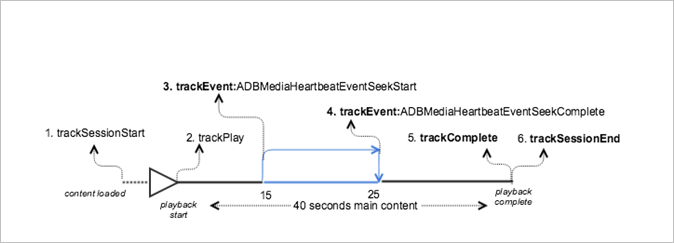

# VOD-uppspelning med sökning i huvudinnehåll{#vod-playback-with-seeking-in-the-main-content}

## Scenario {#scenario}

Detta scenario omfattar sökning i huvudinnehållet under uppspelning.

Detta är samma scenario som [VOD-uppspelningen utan annonser](/help/sdk-implement/tracking-scenarios/vod-no-intrs-details.md)-scenariot, men en del av innehållet stegas igenom och en sökning utförs från en punkt i huvudinnehållet till en annan punkt.

| Utlösare   | Heartbeat-metod   | Nätverksanrop   | Anteckningar   |
| --- | --- | --- | --- |
| Användaren klickar på [!UICONTROL Play] | `trackSessionStart` | Börja med Analytics-innehåll, starta pulsslagsinnehåll | Mätbiblioteket är ovetande om att det finns en förrollad annons, så dessa nätverksanrop är identiska med [VOD-uppspelningen utan annonser](/help/sdk-implement/tracking-scenarios/vod-no-intrs-details.md)-scenariot. |
| Den första bildrutan i innehållet spelas upp. | `trackPlay` | Spela upp pulsslagsinnehåll | När kapitelinnehåll spelas upp före huvudinnehållet startar Heartslag när kapitlet börjar. |
| Innehåll spelas upp |  | Hjärtslag för innehåll | Detta nätverksanrop är exakt detsamma som [VOD-uppspelningen utan annonser](/help/sdk-implement/tracking-scenarios/vod-no-intrs-details.md)-scenariot. |
| Användaren börjar söka efter innehåll | `trackSeekStart` |  | Inga pulsslag går ut tills sökningen är klar, till exempel `trackSeekComplete` |
| Sökningen har slutförts | `trackSeekComplete` |  | Hjärtslag börjar gå ut eftersom sökningen är klar.  Tips:  Spelhuvudets värde ska representera det nya spelhuvudet efter sökningen. |
| Innehållet är färdigt | `trackComplete` | Hearsbeat-innehåll slutfört | Detta nätverksanrop är exakt detsamma som [VOD-uppspelningen utan annonser](/help/sdk-implement/tracking-scenarios/vod-no-intrs-details.md)-scenariot. |
| Sessionen är över | `trackSessionEnd` |  | `SessionEnd` |

## Exempelkod {#sample-code}

I det här scenariot söker användaren efter när huvudinnehållet spelas upp.



### Android

Ställ in följande kod för att visa det här scenariot i Android:

```java
// Set up mediaObject 
MediaObject mediaInfo = MediaHeartbeat.createMediaObject( 
  Configuration.MEDIA_NAME,  
  Configuration.MEDIA_ID,  
  Configuration.MEDIA_LENGTH,  
  MediaHeartbeat.StreamType.VOD 
); 

HashMap<String, String> mediaMetadata = new HashMap<String, String>(); 
mediaMetadata.put(CUSTOM_KEY_1, CUSTOM_VAL_1); 
mediaMetadata.put(CUSTOM_KEY_2, CUSTOM_VAL_2); 

// 1. Call trackSessionStart() when the user clicks Play or if autoplay is used,  
//    i.e., there is an intent to start playback.  
_mediaHeartbeat.trackSessionStart(mediaInfo, mediaMetadata); 

...... 
...... 

// 2. Call trackPlay() when the playback actually starts, i.e., whn the first frame  
//    of the main content is rendered on the screen.  
_mediaHeartbeat.trackPlay(); 

....... 
....... 

// 3. Track the MediaHeartbeat.Event.SeekStart event when the user begins to seek.  
_mediaHeartbeat.trackEvent(MediaHeartbeat.Event.SeekStart, null, null); 

....... 
....... 

// 4. Track the MediaHeartbeat.Event.SeekComplete event when the user completes seeking 
_mediaHeartbeat.trackEvent(MediaHeartbeat.Event.SeekComplete, null, null); 

....... 
....... 

// 5. Call trackComplete() when the playback reaches the end, i.e., when the media 
//    completes and finishes playing. 
_mediaHeartbeat.trackComplete(); 

........ 
........ 

// 6. Call trackSessionEnd() when the playback session is over. This method must be  
//    called even if the user does not watch the media to completion.  
_mediaHeartbeat.trackSessionEnd(); 

........ 
........ 
```

### iOS

Ställ in följande kod för att visa det här scenariot i iOS:

```
// Set up mediaObject 
ADBMediaObject *mediaObject =  
[ADBMediaHeartbeat createMediaObjectWithName:MEDIA_NAME o 
                   length:MEDIA_LENGTH  
                   streamType:ADBMediaHeartbeatStreamTypeVOD]; 
 
NSMutableDictionary *mediaContextData = [[NSMutableDictionary alloc] init]; 
[mediaContextData setObject:CUSTOM_VAL_1 forKey:CUSTOM_KEY_1]; 
[mediaContextData setObject:CUSTOM_VAL_2 forKey:CUSTOM_KEY_2]; 

// 1. Call trackSessionStart when the user clicks Play or if autoplay is used,  
//    i.e., there is an intent to start playback. 
[_mediaHeartbeat trackSessionStart:mediaObject data:mediaContextData]; 
....... 
....... 

// 2. Call trackPlay when the playback actually starts, i.e., when the 
//    first frame of the main content is rendered on the screen. 
[_mediaHeartbeat trackPlay];  
....... 
....... 

// 3. Track the trackEvent:ADBMediaHeartbeatEventSeekStart event when the user  
//    begins to seek out of the chapter with the intent to skip it. 
[_mediaHeartbeat trackEvent:ADBMediaHeartbeatEventSeekStart  
               mediaObject:nil  
               data:nil]; 
....... 
....... 

// 4. Track the trackEvent:ADBMediaHeartbeatEventSeekComplete event when the  
//    user seeks out of the chapter with the intent to skip it. 
[_mediaHeartbeat trackEvent:ADBMediaHeartbeatEventSeekComplete  
               mediaObject:nil  
               data:nil]; 
....... 
....... 

// 5. Call trackComplete when the playback reaches the end, i.e., completes  
//    and finishes playing. 
[_mediaHeartbeat trackComplete]; 
....... 
....... 

// 6. Call trackSessionEnd when the playback session is over. This method must  
//    be called even if the user does not watch the media to completion. 
[_mediaHeartbeat trackSessionEnd]; 
....... 
....... 
```

### JavaScript

Om du vill visa det här scenariot anger du följande text:

```js
// Set up mediaObject 
var mediaInfo = MediaHeartbeat.createMediaObject( 
  Configuration.MEDIA_NAME,  
  Configuration.MEDIA_ID,  
  Configuration.MEDIA_LENGTH,  
  MediaHeartbeat.StreamType.VOD 

); 

var mediaMetadata = { 
  CUSTOM_KEY_1 : CUSTOM_VAL_1,  
  CUSTOM_KEY_2 : CUSTOM_VAL_2,  
  CUSTOM_KEY_3 : CUSTOM_VAL_3 

}; 

// 1. Call trackSessionStart() when Play is clicked or if autoplay is used,  
//    i.e., there's an intent to start playback. 
this._mediaHeartbeat.trackSessionStart(mediaInfo, mediaMetadata); 

...... 
...... 

// 2. Call trackPlay() when the playback actually starts, i.e., when the  
//    first frame of the ad media is rendered on the screen. 
this._mediaHeartbeat.trackPlay(); 

....... 
....... 

// 3. Track the MediaHeartbeat.Event.SeekStart event when the user  
//    begins to seek. 
this._mediaHeartbeat.trackEvent(MediaHeartbeat.Event.SeekStart); 

....... 
....... 

// 4. Track the MediaHeartbeat.Event.SeekComplete event when the user  
//    completes seeking. 
this._mediaHeartbeat.trackEvent(MediaHeartbeat.Event.SeekComplete); 

....... 
....... 

// 5. Call trackComplete() when the playback reaches the end, i.e., when 
//    playback completes and finishes playing. 
this._mediaHeartbeat.trackComplete(); 

........ 
........ 

// 6. Call trackSessionEnd() when the playback session is over. This method must be called  
//    even if the user does not watch the media to completion. 
this._mediaHeartbeat.trackSessionEnd(); 

........ 
........ 
```
