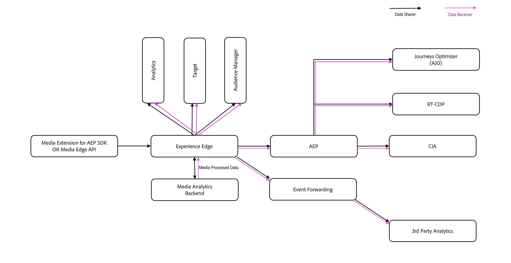

# Federated Media{#federated-media}

Tjänsten Federated Media är ett system för delning av strömmande mediedata (ljud och video) mellan två partners.
De standardiserade mätdata som skapas av Streaming Media Collection är ett kännetecken för Federated Media, vilket gör att samma data kan flöda in i en enda rapport från flera källor.
Tack vare de regler och den logik som styr Federated Media kan data enkelt styras och individanpassas för att uppfylla behoven i varje partnerskap.
Med Federated Media blir ljud- och videomätningarna effektivare, smidigare och mer användbara.

## Fördelar {#benefits}

* **Genomskinligt:** Avmystifiera dataskapande genom att använda samma logik i flera företag
* **Bredd:** Förstå den fulla räckvidden och effekten av ljud- och videokonsumtion för olika partnerskap, plattformar och enheter
* **Säkert:** Styr datadelning på serversidan med hjälp av regler och logik
* **Standardiserat:** Tala samma dataspråk som era partners
* **Verkställbart:** Mät ljud- och videodata för att testa spelare, övervaka trender och upptäcka avvikelser med Adobe Analytics
* **Centraliserat:** Samla in ljud- och videomätningsdata på en och samma Adobe-plats
* **Avtalsenligt:** Uppfyll enkelt de juridiska kraven på datadelning
* **Tidsanpassat:** Skicka och ta emot data i nära realtid
* **Enkelt:** Tagga spelare en gång med Adobes SDK:er och dela data med flera partners

## Definitioner {#definitions}

* **Avsändare:** Kunden som genererar ljud- och videoanalysdata för egna spelare
* **Mottagare:** Kunden som tar emot ljud- och videoanalysdata från avsändaren

## Krav {#requirements}

* **Avtal om medieströmmar:** Mottagaren och avsändaren måste ha ingått avtal med Adobe Analytics för medieströmmar innan de får tillgång till ljud- och videodata i Adobe Analytics. Kontakta ditt kontoteam om du vill ha mer information.
* **Federationstillägg:** Varje avsändare och mottagare måste ha undertecknat ett tillägg med Adobe innan data skickas eller tas emot. Ett tillägg per kund krävs, inte ett tillägg per partnerskap. Kontakta ditt kontoteam om du vill ha mer information.

* **Implementering av mediainsamling för direktuppspelning:** Avsändaren måste ha den direktuppspelande mediainsamlingen implementerad på alla spelare som kommer att ingå i den federerade datauppsättningen. Endast direktuppspelande mediedata är tillgängliga för federation. Mer information finns i [Adobe Streaming Media Collection - översikt](/help/media-overview.md).

* **Konsultavtal med Adobe:** Vid den inledande konfigureringen av regler för federering är det praktiskt att samarbeta med våra konsulter för att granska data och skapa datadelningsavtalet.

## Ladda ned Federated Media Form

Om du vill delta i Federated Media hämtar och fyller du i formuläret [Federation Rules Agreement](assets/federated_analytics_form.pdf).

## Process {#process}

1. Avsändare och mottagare arbetar tillsammans för att slutföra avtalet om regler för federering. Avtalsformuläret om regler för federering innehåller specialfält för våra tekniker och ska ENDAST redigeras med Adobe Acrobat. [Ladda ned Acrobat utan kostnad.](https://get.adobe.com/se/reader/)
1. Mottagaren får en exempeldatafil från konsulttjänsten som innehåller faktiska data från avsändarens spelare för att bekräfta att rätt regler för datadelning har definierats, förutsatt att datafiler finns tillgängliga.
1. Avsändaren och mottagaren ser till att datadelningsavtalet uppfyller alla avtalsmässiga krav mellan de båda parterna.
1. Konsulttjänsten skickar det ifyllda formuläret till Adobes tekniker som skapar regler för datadelning.
1. Data delas med utvecklaren av Adobe Analytics rapportserie eller Adobe Experience Platform datastream där Mottagaren granskar och validerar data.
1. När mottagaren har bekräftat att data är korrekta uppdaterar Adobe Engineering reglerna till att peka på en produktionsanalysrapportsvit eller Adobe Experience Platform datastream.
1. Mottagaren granskar och validerar data i produktionsanalysrapportsviten eller Adobe Experience Platform datastream.
1. Om datauppsättningen ändras i framtiden kan avsändaren eller mottagaren kontakta supporten genom att skicka en supportbegäran.
