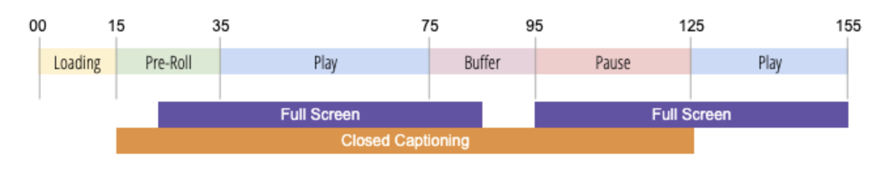

# Om Spårning av spelartillstånd

För att optimera produktupplevelsen och öka värdet för ert företag är det viktigt att förstå kundbeteendet när ni tittar på videor. Detta inkluderar tiden som tillbringats i olika spelarlägen.  Det är också viktigt att ha flexibiliteten att skapa och mäta nya spelarlägen och händelser efter behov.

Med Spårning av spelarstatus kan du fånga upp visningsprogrammets interaktion under uppspelning med en standarduppsättning av lösningsvariabler för helskärmsläge, undertexter, ljud av, bild-i-bild och i fokus.  Spårning av spelarstatus ger även flexibilitet att skapa anpassade spelarlägen. Du kan använda variabler för spårning av spelartillstånd för rapportering i Analysis Workspace.

Om du vill hämta ändringar av spelarläget uppdaterar Player State Tracking metadata för videomätningen. Om du till exempel vill fastställa videoengagemanget&quot;true&quot; mäter Flash Player State Tracking den tid som spenderas med ljudet i stället för med passiva eller icke-aktiva videobilder när ljudet är avstängt eller den tid som spenderas i läget Normal jämfört med helskärm.

Spårning av spelarstatus ger följande fördelar:

* Tillhandahåller standardvariabler som mäter vanliga lägen, till exempel helskärmsläge eller undertextning
* Tillhandahåller anpassningsbara variabler för mätning av anpassade lägen under en uppspelningssession
* Mäter tid i ett anpassat spelarläge
* Mäter flera lägen som kan vara samtidigt

## Krav

Spårning av spelartillstånd kräver något av följande för datainsamling:
* Media JS SDK 3.0+
* Chromecast 3.0 SDK for Adobe Marketing Cloud Solutions
* Media Analytics Extension (används med Adobe Experience Platform (AEP) SDK)
   * Webb: Adobe Media Analytics (3.x SDK) för ljud och video v1.0+
   * Mobil: Adobe Media Analytics for Audio and Video v2.0+
* Media Collection API

## Riktlinjer

Innan du implementerar spårning av spelartillstånd bör du tänka på följande riktlinjer.

* Spelarläget beräknas för alla uppspelningslägen (ingen delning).
* Du kan mäta flera spelarlägen samtidigt.
* Det högsta antalet spelarlägen som kan spåras under en uppspelning är 10.
* Statusvärden för spelarstatus skickas till Analytics för att enbart rapportera om Media Close-anropet.
* Kunskap om programstatus bevaras inte när ett läge har stoppats. När ett läge har avslutats måste läget startas igen för att fortsätta spåra. För varje nytt uppspelningsläge måste spelarens tillstånd startas igen.
* Spelartillstånd hämtas för varje enskild uppspelningssession - spelarläget beräknas inte för alla uppspelningar.
