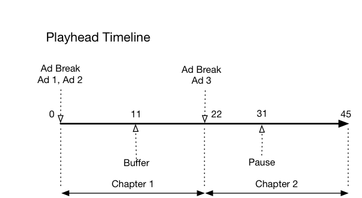

# Tidslinje: Kapitel {#timeline-3-chapters}

## VOD, pre-roll ads, pausa, buffra, visa innehållet i slutet

I följande diagram visas spelhuvudets tidslinje och motsvarande tidslinje för en användares åtgärder. Nedan presenteras närmare uppgifter om varje åtgärd och de tillhörande ansökningarna.




## Åtgärdsinformation

### Åtgärd 1 - Starta session {#Action-1}

| Åtgärd | Tidslinje för åtgärd (sekunder) | Spelhuvudsposition (sekunder) | Klientbegäran |
| --- | :---: | :---: | --- |
| Automatiskt uppspelad eller uppspelningsknappen nedtryckt börjar videoinläsningen. | 0 | 0 | `/api/v1/sessions` |

Dessa samtalssignaler _användarens avsikt att spela_ en video. Det returnerar ett sessions-ID ( `{sid}` ) till klienten som används för att identifiera alla efterföljande spårningsanrop i sessionen. Spelarläget är inte&quot;uppspelning&quot; än, utan är i stället&quot;start&quot;.  Obligatoriska sessionsparametrar måste inkluderas i `params` karta i begärandetexten.  I bakgrunden genererar det här samtalet ett Adobe Analytics-initieringssamtal. Mer information om sessioner finns i dokumentationen för Media Collection API.

```json
{
    "playerTime": {
        "playhead": 0,
        "ts": "<timestamp>"
    },
    "eventType": "sessionStart",
    "params": {
        "media.playerName": "sample-html5-api-player",
        "analytics.trackingServer": "[ _YOUR-TS_ ]",
        "analytics.reportSuite": "[ _YOUR_RSID_ ]",
        "analytics.visitorId": "[ _YOUR_VISITOR_ID_ ]",
        "media.contentType": "VOD",
        "media.length": 60.3333333333333,
        "media.id": "VA API Sample Player",
        "visitor.marketingCloudOrgId": "[YOUR_MCID]",
        "media.name": "ClickMe",
        "media.channel": "sample-channel",
        "media.sdkVersion": "va-api-0.0.0",
        "analytics.enableSSL": false
    }
}
```

### Åtgärd 2 - Ping-tidtagaren startar {#Action-2}

| Åtgärd | Tidslinje för åtgärd (sekunder) | Spelhuvudsposition (sekunder) | Klientbegäran |
| --- | :---: | :---: | --- |
| Appen börjar pinga händelsetimer | 0 | 0 |  |

Starta ping-timern. Den första ping-händelsen ska sedan utlösas 1 sekund om det finns annonser före rullning, annars 10 sekunder.

### Åtgärd 3 - annonsradbrytning - start {#Action-3}

| Åtgärd | Tidslinje för åtgärd (sekunder) | Spelhuvudsposition (sekunder) | Klientbegäran |
| --- | :---: | :---: | --- |
| Spåra start av annonsbrytning före rullning | 0 | 0 | `/api/v1/sessions/{sid}/events` |

Annonserna kan bara spåras inom en annonsbrytning.

```json
{
    "playerTime": {
        "playhead": 0,
        "ts": "<timestamp>"
    },
    "eventType": "adBreakStart",
    "params": {
        "media.ad.podFriendlyName": "ad_pod1",
        "media.ad.podIndex": 0, "media.ad.podSecond": 0
    }
}
```

### Åtgärd 4 - annonsstart {#Action-4}

| Åtgärd | Tidslinje för åtgärd (sekunder) | Spelhuvudsposition (sekunder) | Klientbegäran |
| --- | :---: | :---: | --- |
| Spåra start av förrullningsannons nr 1 | 0 | 0 | `/api/v1/sessions/{sid}/events` |

Börja spåra den första pre-roll-annonsen, som är 15 sekunder lång. Inkludera anpassade metadata med detta `adStart` .

```json
{
    "playerTime": {
        "playhead": 0,
        "ts": "<timestamp>"
    },
    "eventType": "adStart",
    "params": {
        "media.ad.podFriendlyName": "ad_pod1",
        "media.ad.name": "Ad 1",
        "media.ad.id": "001",
        "media.ad.length": 15,
        "media.ad.podPosition": 1,
        "media.ad.playerName": "Sample Player",
        "media.ad.advertiser": "Ad Guys",
        "media.ad.campaignId": "1",
        "media.ad.creativeId": "42",
        "media.ad.siteId": "XYZ",
        "media.ad.creativeURL": "https://example.com",
        "media.ad.placementId": "sample_placement"
    },
    "customMetadata": {
        "myCustomData1": "CustomData1",
        "myCustomData2": "CustomData2"
    }
}
```

### Åtgärd 5 - annonsmaterial {#Action-5}

| Åtgärd | Tidslinje för åtgärd (sekunder) | Spelhuvudsposition (sekunder) | Klientbegäran |
| --- | :---: | :---: | --- |
| Appen skickar ping-händelse | 10 | 0 | `/api/v1/sessions/{sid}/events` |

Rita serverdelen var 1 sekund. (Efterföljande reklamskyltar visas inte av utrymmesskäl.)

```json
{
    "playerTime": {
        "playhead": 0,
        "ts": "<timestamp>"
    },
    "eventType": "ping"
}
```

### Åtgärd 6 - annonsen är klar {#Action-6}

| Åtgärd | Tidslinje för åtgärd (sekunder) | Spelhuvudsposition (sekunder) | Klientbegäran |
| --- | :---: | :---: | --- |
| Spåra förrullad annons nr 1 slutförd | 15 | 0 | `/api/v1/sessions/{sid}/events` |

Spåra slutet av den första pre-roll-annonsen.

```json
{
    "playerTime": {
        "playhead": 0,
        "ts": "<timestamp>"
    },
    "eventType": "adComplete"
}
```

### Åtgärd 7 - annonsstart {#Action-7}

| Åtgärd | Tidslinje för åtgärd (sekunder) | Spelhuvudsposition (sekunder) | Klientbegäran |
| --- | :---: | :---: | --- |
| Spåra start av förrullningsannons nr 2 | 15 | 0 | `/api/v1/sessions/{sid}/events` |

Spåra början av den andra pre-roll-annonsen, som är 7 sekunder lång.

```json
{
    "playerTime": {
        "playhead": 0,
        "ts": "<timestamp>"
    },
    "eventType": "adStart",
    "params": {
        "media.ad.podFriendlyName": "ad_pod1",
        "media.ad.name": "Ad 2",
        "media.ad.id": "002",
        "media.ad.length": 7,
        "media.ad.podPosition": 1,
        "media.ad.playerName": "Sample Player",
        "media.ad.advertiser": "Ad Guys",
        "media.ad.campaignId": "2",
        "media.ad.creativeId": "44",
        "media.ad.siteId": "XYZ",
        "media.ad.creativeURL": "https://example.com",
        "media.ad.placementId": "sample_placement2"
    },
}
```

### Åtgärd 8 - Annonsmaterial {#Action-8}

| Åtgärd | Tidslinje för åtgärd (sekunder) | Spelhuvudsposition (sekunder) | Klientbegäran |
| --- | :---: | :---: | --- |
| Appen skickar ping-händelse | 16 | 0 | `/api/v1/sessions/{sid}/events` |

Rita serverdelen var 1 sekund. (Efterföljande reklamskyltar visas inte av utrymmesskäl.)

```json
{
    "playerTime": {
        "playhead": 0,
        "ts": "<timestamp>"
    },
    "eventType": "ping"
}
```

### Åtgärd 9 - Ad complete {#Action-9}

| Åtgärd | Tidslinje för åtgärd (sekunder) | Spelhuvudsposition (sekunder) | Klientbegäran |
| --- | :---: | :---: | --- |
| Spåra förrullningsannons nr 2 slutförd | 22 | 0 | `/api/v1/sessions/{sid}/events` |

Spåra slutet av den andra pre-roll-annonsen.

```json
{
    "playerTime": {
        "playhead": 0,
        "ts": "<timestamp>"
    },
    "eventType": "adComplete"
}
```

### Åtgärd 10 - Ad break complete {#Action-10}

| Åtgärd | Tidslinje för åtgärd (sekunder) | Spelhuvudsposition (sekunder) | Klientbegäran |
| --- | :---: | :---: | --- |
| Spåra pre-roll ad break complete | 22 | 0 | `/api/v1/sessions/{sid}/events` |

Annonsbrytningen är över. Under reklampausen har lekläget fortsatt att&quot;leka&quot;.

```json
{
    "playerTime": {
        "playhead": 0,
        "ts": "<timestamp>"
    },
    "eventType": "adBreakComplete"
}
```

### Åtgärd 11 - Spela upp innehåll {#Action-11}

| Åtgärd | Tidslinje för åtgärd (sekunder) | Spelhuvudsposition (sekunder) | Klientbegäran |
| --- | :---: | :---: | --- |
| Spåra uppspelningshändelse | 22 | 0 | `/api/v1/sessions/{sid}/events` |

Efter `adBreakComplete` -händelsen, placerar spelaren i uppspelningsläge med `play` -händelse.

```json
{
    "playerTime": {
        "playhead": 0,
        "ts": "<timestamp>"
    },
    "eventType": "play"
}
```

### Åtgärd 12 - Kapitelstart {#Action-12}

| Åtgärd | Tidslinje för åtgärd (sekunder) | Spelhuvudsposition (sekunder) | Klientbegäran |
| --- | :---: | :---: | --- |
| Spåra kapitelstarthändelse | 23 | 1 | `/api/v1/sessions/{sid}/events` |

Efter play-händelsen spårar du början av det första kapitlet.

```json
{
    "playerTime": {
        "playhead": 0,
        "ts": "<timestamp>"
    },
    "eventType": "chapterStart",
    "params": {
        "media.chapter.index": 1,
        "media.chapter.offset": 0, "media.chapter.length": 20, "media.chapter.friendlyName": "Chapter Uno"
    },
}
```

### Åtgärd 13 - Ping {#Action-13}

| Åtgärd | Tidslinje för åtgärd (sekunder) | Spelhuvudsposition (sekunder) | Klientbegäran |
| --- | :---: | :---: | --- |
| Appen skickar ping-händelse | 30 | 8 | `/api/v1/sessions/{sid}/events` |

Ringa backend var 10:e sekund.

```json
{
    "playerTime": {
        "playhead": 8,
        "ts": "<timestamp>"
    },
    "eventType": "ping"
}
```

### Åtgärd 14 - Buffertstart {#Action-14}

| Åtgärd | Tidslinje för åtgärd (sekunder) | Spelhuvudsposition (sekunder) | Klientbegäran |
| --- | :---: | :---: | --- |
| Buffertstarthändelse inträffade | 33 | 11 | `/api/v1/sessions/{sid}/events` |

Spåra flytten till buffringsläget.

```json
{
    "playerTime": {
        "playhead": 11,
        "ts": "<timestamp>"
    },
    "eventType": "bufferStart"
}
```

### Åtgärd 15 - Buffertslut (uppspelning) {#Action-15}

| Åtgärd | Tidslinje för åtgärd (sekunder) | Spelhuvudsposition (sekunder) | Klientbegäran |
| --- | :---: | :---: | --- |
| Buffringen är avslutad, programmet spårar återanvändning av innehåll | 36 | 11 | `/api/v1/sessions/{sid}/events` |

Buffringen slutar efter 3 sekunder, så ställ in spelaren i uppspelningsläge igen. Du måste skicka ytterligare en spårets uppspelningshändelse som slutar buffras.  **The `play` ring efter `bufferStart` infogar ett &quot;bufferEnd&quot;-anrop i bakänden,** så det finns inget behov av `bufferEnd` -händelse.

```json
{
    "playerTime": {
        "playhead": 11,
        "ts": "<timestamp>"
    },
    "eventType": "play"
}
```

### Åtgärd 16 - Ping {#Action-16}

| Åtgärd | Tidslinje för åtgärd (sekunder) | Spelhuvudsposition (sekunder) | Klientbegäran |
| --- | :---: | :---: | --- |
| Appen skickar ping-händelse | 40 | 15 | `/api/v1/sessions/{sid}/events` |

Ringa backend var 10:e sekund.

```json
{
    "playerTime": {
        "playhead": 15,
        "ts": "<timestamp>"
    },
    "eventType": "ping"
}
```

### Åtgärd 17 - Kapitel slut {#Action-17}

| Åtgärd | Tidslinje för åtgärd (sekunder) | Spelhuvudsposition (sekunder) | Klientbegäran |
| --- | :---: | :---: | --- |
| Kapitelslut för appspår | 45 | 20 | `/api/v1/sessions/{sid}/events` |

Det första kapitlet avslutas precis före den andra annonsbrytningen.

```json
{
    "playerTime": {
        "playhead": 20,
        "ts": "<timestamp>"
    },
    "eventType": "chapterComplete"
}
```

### Åtgärd 18 - Annonsuppspelning - start {#Action-18}

| Åtgärd | Tidslinje för åtgärd (sekunder) | Spelhuvudsposition (sekunder) | Klientbegäran |
| --- | :---: | :---: | --- |
| Spåra start av annonsbrytning mitt i rullen | 46 | 21 | `/api/v1/sessions/{sid}/events` |

Adress mellan rullar med 8 sekunders varaktighet: skicka `adBreakStart` .

```json
{
    "playerTime": {
        "playhead": 21,
        "ts": "<timestamp>"
    },
    "eventType": "adBreakStart",
    "params": {
        "media.ad.podFriendlyName": "ad_pod2",
        "media.ad.podIndex": 1, "media.ad.podSecond": 21
    }
}
```

### Åtgärd 19 - annonsstart {#Action-19}

| Åtgärd | Tidslinje för åtgärd (sekunder) | Spelhuvudsposition (sekunder) | Klientbegäran |
| --- | :---: | :---: | --- |
| Spåra start av annonsering nr 3 i mellanrullning | 46 | 21 | `/api/v1/sessions/{sid}/events` |

Spåra annonsen i mellanrullen.

```json
{
    "playerTime": {
        "playhead": 21,
        "ts": "<timestamp>"
    },
    "eventType": "adStart",
    "params": {
        "media.ad.podFriendlyName": "ad_pod2",
        "media.ad.name": "Ad 3",
        "media.ad.id": "003",
        "media.ad.length": 8,
        "media.ad.podPosition": 2,
        "media.ad.playerName": "Sample Player",
        "media.ad.advertiser": "Ad Guys",
        "media.ad.campaignId": "7",
        "media.ad.creativeId": "40",
        "media.ad.siteId": "XYZ",
        "media.ad.creativeURL": "https://example.com",
        "media.ad.placementId": "sample_placement2"
    },
}
```

### Åtgärd 20 - annonsmaterial {#Action-20}

| Åtgärd | Tidslinje för åtgärd (sekunder) | Spelhuvudsposition (sekunder) | Klientbegäran |
| --- | :---: | :---: | --- |
| Appen skickar ping-händelse | 47 | 21 | `/api/v1/sessions/{sid}/events` |

Rita serverdelen var 1 sekund. (Efterföljande reklamskyltar visas inte av utrymmesskäl.)

```json
{
    "playerTime": {
        "playhead": 21,
        "ts": "<timestamp>"
    },
    "eventType": "ping"
}
```

### Åtgärd 21 - Ad complete {#Action-21}

| Åtgärd | Tidslinje för åtgärd (sekunder) | Spelhuvudsposition (sekunder) | Klientbegäran |
| --- | :---: | :---: | --- |
| Spåra annonsering nr 1 i mellanrullen slutförd | 54 | 21 | `/api/v1/sessions/{sid}/events` |

Mittrollannonsen är färdig.

```json
{
    "playerTime": {
        "playhead": 21,
        "ts": "<timestamp>"
    },
    "eventType": "adComplete"
}
```

### Åtgärd 22 - Ad break complete {#Action-22}

| Åtgärd | Tidslinje för åtgärd (sekunder) | Spelhuvudsposition (sekunder) | Klientbegäran |
| --- | :---: | :---: | --- |
| Spåra annonsbrytning mitt i rullen | 54 | 21 | `/api/v1/sessions/{sid}/events` |

Annonsbrytningen är klar.

```json
{
    "playerTime": {
        "playhead": 21,
        "ts": "<timestamp>"
    },
    "eventType": "adBreakComplete"
}
```

### Åtgärd 23 - Kapitelstart {#Action-23}

| Åtgärd | Tidslinje för åtgärd (sekunder) | Spelhuvudsposition (sekunder) | Klientbegäran |
| --- | :---: | :---: | --- |
| Spåra början av kapitel 2 | 55 | 22 | `/api/v1/sessions/{sid}/events` |


```json
{
    "playerTime": {
        "playhead": 22,
        "ts": "<timestamp>"
    },
    "eventType": "chapterStart",
    "params": {
        "media.chapter.index": 2,
        "media.chapter.offset": 22, "media.chapter.length": 22, "media.chapter.friendlyName": "Chapter Dos"
    },
}
```

### Åtgärd 24 - Ping {#Action-24}

| Åtgärd | Tidslinje för åtgärd (sekunder) | Spelhuvudsposition (sekunder) | Klientbegäran |
| --- | :---: | :---: | --- |
| Appen skickar ping-händelse | 60 | 27 | `/api/v1/sessions/{sid}/events` |

Ringa backend var 10:e sekund.

```json
{
    "playerTime": {
        "playhead": 27,
        "ts": "<timestamp>"
    },
    "eventType": "ping"
}
```

### Åtgärd 25 - Pausa {#Action-25}

| Åtgärd | Tidslinje för åtgärd (sekunder) | Spelhuvudsposition (sekunder) | Klientbegäran |
| --- | :---: | :---: | --- |
| Användaren klickade på paus | 64 | 31 | `/api/v1/sessions/{sid}/events` |

Användaråtgärden flyttar uppspelningsläget till &quot;pausad&quot;.

```json
{
    "playerTime": {
        "playhead": 31,
        "ts": "<timestamp>"
    },
    "eventType": "pauseStart"
}
```

### Åtgärd 26 - Ping {#Action-26}

| Åtgärd | Tidslinje för åtgärd (sekunder) | Spelhuvudsposition (sekunder) | Klientbegäran |
| --- | :---: | :---: | --- |
| Appen skickar ping-händelse | 70 | 31 | `/api/v1/sessions/{sid}/events` |

Ringa backend var 10:e sekund. Spelaren är fortfarande i buffertläge. användaren sitter fast vid 20 sekunders innehåll. Rensar...

```json
{
    "playerTime": {
        "playhead": 31,
        "ts": "<timestamp>"
    },
    "eventType": "ping"
}
```

### Action 27 - Spela upp innehåll {#Action-27}

| Åtgärd | Tidslinje för åtgärd (sekunder) | Spelhuvudsposition (sekunder) | Klientbegäran |
| --- | :---: | :---: | --- |
| Användaren tryckte på Spela upp för att återuppta huvudinnehållet | 74 | 31 | `/api/v1/sessions/{sid}/events` |

Flytta uppspelningsläget till&quot;uppspelning&quot;.  **The `play` ring efter `pauseStart` infogar ett &quot;resume&quot;-anrop till back end** så du behöver inte `resume` -händelse.

```json
{
    "playerTime": {
        "playhead": 31,
        "ts": "<timestamp>"
    },
    "eventType": "play"
}
```

### Åtgärd 28 - Ping {#Action-28}

| Åtgärd | Tidslinje för åtgärd (sekunder) | Spelhuvudsposition (sekunder) | Klientbegäran |
| --- | :---: | :---: | --- |
| Appen skickar ping-händelse | 80 | 37 | `/api/v1/sessions/{sid}/events` |

Ringa backend var 10:e sekund.

```json
{
    "playerTime": {
        "playhead": 37,
        "ts": "<timestamp>"
    },
    "eventType": "ping"
}
```

### Åtgärd 29 - Kapitel slut {#Action-29}

| Åtgärd | Tidslinje för åtgärd (sekunder) | Spelhuvudsposition (sekunder) | Klientbegäran |
| --- | :---: | :---: | --- |
| Kapitel 2 slutar | 87 | 44 | `/api/v1/sessions/{sid}/events` |

Spåra slutet av det andra och sista kapitlet.

```json
{
    "playerTime": {
        "playhead": 0,
        "ts": "<timestamp>"
    },
    "eventType": "chapterComplete"
}
```

### Åtgärd 30 - Sessionen slutförd {#Action-30}

| Åtgärd | Tidslinje för åtgärd (sekunder) | Spelhuvudsposition (sekunder) | Klientbegäran |
| --- | :---: | :---: | --- |
| Användaren har tittat klart på innehållet. | 88 | 45 | `/api/v1/sessions/{sid}/events` |

Skicka `sessionComplete` till serverdelen för att ange att användaren har tittat klart på hela innehållet.

```json
{
    "playerTime": {
        "playhead": 45,
        "ts": "<timestamp>"
    },
    "eventType": "sessionComplete"
}
```


>[!NOTE]
>
>**Hittar du inga händelser? -** Det finns inget uttryckligt stöd i Media Collection API för `seekStart` eller `seekComplete` händelser. Detta beror på att vissa spelare genererar ett mycket stort antal sådana händelser när slutanvändaren rensar, och att flera hundra användare enkelt kan tappa bort nätverksbandbredden för en backend-tjänst. Adobe kringgår explicit stöd för seek-händelser genom att beräkna pulsslagets varaktighet baserat på enhetens tidsstämpel i stället för spelhuvudets position.
