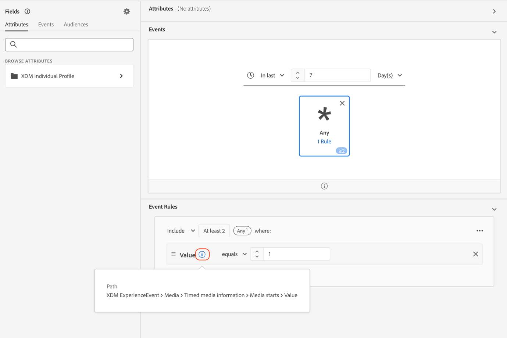
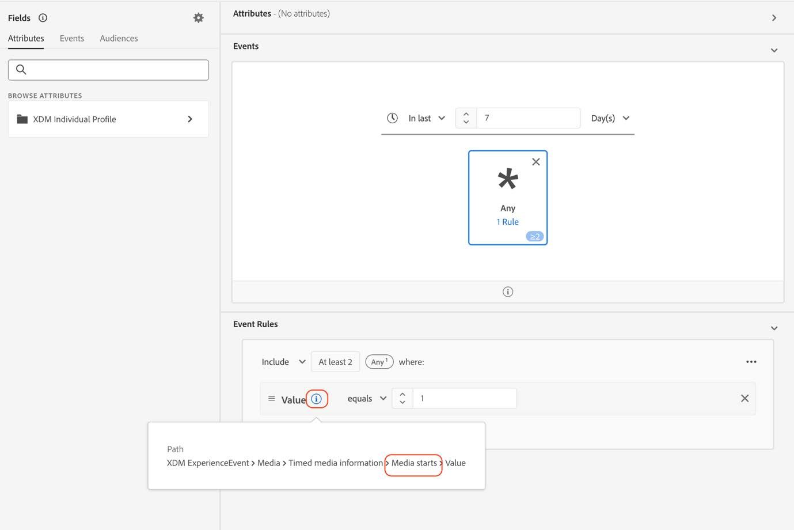

# Migrera målgrupper till de nya mediefälten för direktuppspelning

I det här dokumentet beskrivs hur en målgrupp som använder fält från datatypen Adobe streaming media services som kallas &quot;Media&quot; ska migreras för att använda den nya motsvarande datatypen &quot;[Media Reporting Details](https://experienceleague.adobe.com/sv/docs/experience-platform/xdm/data-types/media-reporting-details)&quot;.

## Migrera en målgrupp

Om du vill migrera en målgrupp från den gamla datatypen Media till den nya datatypen [Information om medierapportering](https://experienceleague.adobe.com/sv/docs/experience-platform/xdm/data-types/media-reporting-details) måste du redigera målgruppen och i varje regel ersätta det gamla fältet från den borttagna datatypen med det nya motsvarande fältet från den nya datatypen:

1. Leta reda på regler som innehåller fält från den inaktuella datatypen&quot;Media&quot;. Det här är alla fält som börjar med sökvägen `media.mediaTimed`.

1. Duplicera dessa regler med fält från den nya datatypen [Media Reporting Details](https://experienceleague.adobe.com/sv/docs/experience-platform/xdm/data-types/media-reporting-details).

1. Ha båda reglerna på plats tills du validerar att målgrupperna fungerar som förväntat.

1. Ta bort reglerna som innehåller fält från datatypen Media.

1. Verifiera att målgrupperna fortfarande fungerar som förväntat.

Se parametern [Innehålls-ID](https://experienceleague.adobe.com/sv/docs/media-analytics/using/implementation/variables/audio-video-parameters#content-id) på sidan [Ljud- och videoparametrar](https://experienceleague.adobe.com/sv/docs/media-analytics/using/implementation/variables/audio-video-parameters) för att mappa mellan de gamla och de nya fälten. Den gamla fältsökvägen finns under egenskapen XDM-fältsökväg medan den nya fältsökvägen finns under egenskapen Reporting XDM-fältsökväg.

## Exempel

För att göra det enklare att följa riktlinjerna för migrering bör du ta följande exempel som innehåller en målgrupp med en enda regel. Eftersom målgruppen har en enda regel behöver du bara tillämpa migreringsriktlinjerna en gång.

1. Markera knappen [!UICONTROL **Redigera målgrupp**] i det övre högra hörnet.

1. Leta reda på reglerna som är konfigurerade för målgruppen.

   

   

1. Välj regeln för att öppna dess konfiguration.

   

1. (Valfritt) Om du vill visa sökvägen till fältet som används i regeln markerar du infoknappen nära fältnamnet.

   

1. Identifiera fältnamnet (i det här fallet &quot;Media Starts&quot;).

   

1. Se sidan [Ljud- och videoparametrar](https://experienceleague.adobe.com/sv/docs/media-analytics/using/implementation/variables/audio-video-parameters) för att mappa mellan de gamla fälten. Den gamla fältsökvägen finns under egenskapen XDM-fältsökväg medan den nya fältsökvägen finns under egenskapen Reporting XDM-fältsökväg. För parametern [Media Starts](https://experienceleague.adobe.com/sv/docs/media-analytics/using/implementation/variables/audio-video-parameters#media-starts) är motsvarande för `media.mediaTimed.impressions.value` till exempel `mediaReporting.sessionDetails.isViewed`.

   

1. Lägg till samma regel som den befintliga i det nya fältet.

   

   

   

1. Välj [!UICONTROL **Spara**] för att spara målgruppen. Du kan behålla den här konfigurationen så länge du behöver verifiera att målgruppen fortfarande fungerar som den ska.

1. När valideringen är klar tar du bort det gamla fältet och väljer [!UICONTROL **Spara**] för att spara målgruppen.

   

1. Validera målgruppen igen.

   Migreringsprocessen är klar.
