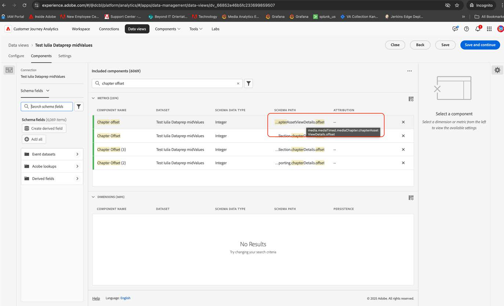
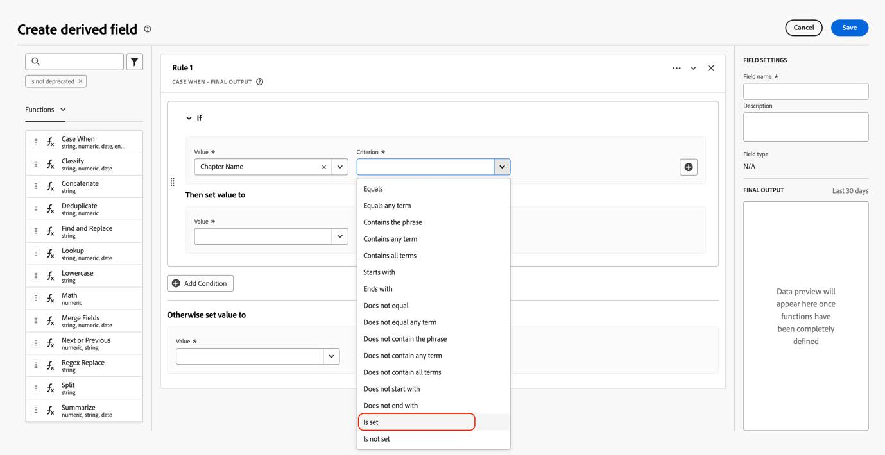
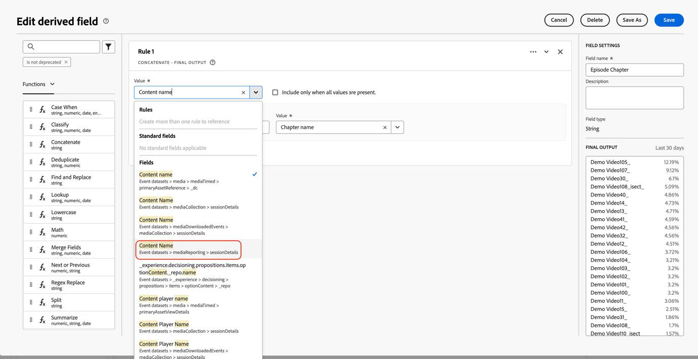

# Migrera Customer Journey Analytics för att använda de nya direktuppspelningsmediefälten

I det här dokumentet beskrivs hur en Customer Journey Analytics-konfiguration som använder datatypen Adobe Streaming Media Collection som kallas &quot;Media&quot; ska uppdateras för att använda den nya motsvarande datatypen &quot;[Media Reporting Details](https://experienceleague.adobe.com/en/docs/experience-platform/xdm/data-types/media-reporting-details)&quot;.

## Migrera Customer Journey Analytics

Om du vill migrera en Customer Journey Analytics-konfiguration från den gamla datatypen Media till den nya datatypen [Media Reporting Details](https://experienceleague.adobe.com/en/docs/experience-platform/xdm/data-types/media-reporting-details) måste du uppdatera följande inställningar som använder den gamla datatypen:

* Datavyer

* Härledda fält

### Migrera datavyer

Så här migrerar du datavyer till den nya datatypen:

1. Leta upp alla datavyer med datatypen Media. Det här är alla fält som sökvägen börjar med `media.mediaTimed` för.

1. Gör något av följande:

   * I dessa datavyer infogar du fälten från den nya datatypen &quot;Media Reporting Details&quot;.

   * Skapa ett härlett fält som använder den nya datatypen &quot;Media Reporting Details&quot; om den är inställd, eller som återgår till den gamla datatypen &quot;Media&quot; om datatypen &quot;Media Reporting Details&quot; inte är inställd.

### Migrera härledda fält

Så här migrerar du härledda fält till den nya datatypen:

1. Leta upp alla härledda fält med datatypen Media. Det här är alla härledda fält som innehåller fält som sökvägen börjar med `media.mediaTimed` för.

1. Ersätt alla gamla fält i det härledda fältet med det nya motsvarande fältet från &quot;Media Reporting Details&quot;.

Se parametern [Innehålls-ID](https://experienceleague.adobe.com/en/docs/media-analytics/using/implementation/variables/audio-video-parameters#content-id) på sidan [Ljud- och videoparametrar](https://experienceleague.adobe.com/en/docs/media-analytics/using/implementation/variables/audio-video-parameters) för att mappa mellan de gamla och de nya fälten. Den gamla fältsökvägen finns under egenskapen XDM-fältsökväg medan den nya fältsökvägen finns under egenskapen Reporting XDM-fältsökväg.

## Exempel

För att göra det enklare att följa riktlinjerna för migrering bör du ta följande exempel som innehåller en datavy med fält från den gamla datatypen &quot;Media&quot;. I den här datavyn måste du lägga till nya motsvarande fält.

### Uppdatera datavyn

Du kan använda något av följande alternativ för att uppdatera datavyn:

#### Alternativ 1

1. Leta upp ett mått eller en dimension som använder det gamla fältet från den inaktuella datatypen.

   

1. Kontrollera motsvarande nya fält i avsnittet [Kapitelförskjutning](https://experienceleague.adobe.com/en/docs/media-analytics/using/implementation/variables/chapter-parameters#chapter-offset) i artikeln [Kapitelparametrar](https://experienceleague.adobe.com/en/docs/media-analytics/using/implementation/variables/chapter-parameters).

1. Leta reda på det nya motsvarande fältet i datavyn.

   

1. Dra det nya fältet till måttet eller måttet.

1. Upprepa den här processen för alla mått och mått som använder fält från den inaktuella datatypen Media.

#### Alternativ 2

Med det här alternativet skapas ett härlett fält som väljer värdet från det gamla fältet eller värdet från det nya fältet baserat på vilket det finns ett för en viss händelse. Det här härledda fältet ersätter den gamla datatypen &quot;Media&quot; i alla projekt där den används.

Om du vill skapa ett härlett fält för &quot;Kapitelnamn&quot; som använder den nya datatypen &quot;Media Reporting Details&quot; om den är inställd, eller som återgår till den gamla datatypen &quot;Media&quot; om datatypen &quot;Media Reporting Details&quot; inte är inställd:

1. Dra en&quot;Case When&quot;-sats till de härledda fälten.

   

1. Fyll i [!UICONTROL **If**]-satsen med värdet för **Reporting XDM-fältsökvägen**, vilket visas i parametern [Chapter name](https://experienceleague.adobe.com/en/docs/media-analytics/using/implementation/variables/chapter-parameters#chapter-name) på sidan [Chapter parameters](https://experienceleague.adobe.com/en/docs/media-analytics/using/implementation/variables/chapter-parameters) .

   

   

   

   

1. Fyll i reservvärdet med det gamla fältet från den inaktuella datatypen Media.

   

   

   Detta är den slutliga definitionen av det härledda fältet.

   

1. Om du vill uppdatera de härledda fälten letar du reda på ett härlett fält som använder de gamla inaktuella fälten (sökvägen börjar med `media.mediaTimed`).

   

1. För musen över det härledda fält som du vill uppdatera och välj sedan ikonen [!UICONTROL **Redigera**] .

1. Leta upp alla fält från den gamla datatypen (sökväg som börjar med `media.mediaTimed`) och ersätt dem med det nya motsvarande fältet.

   

1. Kontrollera motsvarande nya fält i avsnittet [Innehållsnamn (variabel)](https://experienceleague.adobe.com/en/docs/media-analytics/using/implementation/variables/audio-video-parameters#content-name-variable) i artikeln [Direktuppspelningsmediaparametrar](https://experienceleague.adobe.com/en/docs/media-analytics/using/implementation/variables/audio-video-parameters#content-name-variable).

1. Ersätt det gamla fältet med det nya fältet.

   

1. Upprepa den här processen för alla härledda fält med hjälp av fält från den gamla inaktuella datatypen &quot;Media&quot;.

   Migreringen av CJA-installationen är klar.

