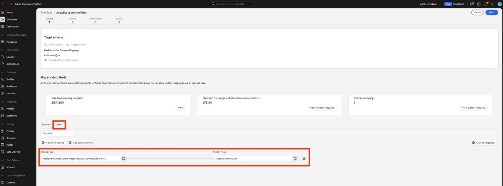

# Migrera dataprep för anpassade fält till nya direktuppspelade mediefält

I det här dokumentet beskrivs processen att migrera den Data Prep-tjänst som finns ovanpå de Adobe Data Collection-flöden som är aktiverade för Adobe Streaming Media Collection-data. Migreringen konverterar en datapresentationsmappning från datatypen Adobe Streaming Media Collection som kallas &quot;Media&quot; till att använda den nya motsvarande datatypen &quot;[Media Reporting Details](https://experienceleague.adobe.com/sv/docs/experience-platform/xdm/data-types/media-reporting-details)&quot;.

## Migrera dataprep för anpassade fält

Om du vill migrera datapresentationsmappningar från den gamla datatypen Media till den nya datatypen [Information om medierapportering](https://experienceleague.adobe.com/sv/docs/experience-platform/xdm/data-types/media-reporting-details) måste du redigera dataprexamappningarna:

>[!IMPORTANT]
>
>För att undvika att förlora data måste du se till att Analytics-källkopplingen har distribuerats med de nya `mediaReporting`-fälten innan du slutför stegen i det här avsnittet.

1. Gå till fliken [!UICONTROL **Dataflöden**] under avsnittet [!UICONTROL **Källor**] i Adobe Experience Platform.

1. Leta reda på det dataflöde som ligger till grund för importen av strömmande mediedata från Adobe Analytics till Adobe Experience Platform via Adobe Data Collection.

1. Välj [!UICONTROL **Uppdatera dataflöde**] om du vill ändra inställningarna för datapresentation genom att ersätta alla anpassade källmappningar som innehåller ett inaktuellt fält med det nya motsvarande fältet från det nya XDM-objektet.

1. Leta reda på mappningarna som innehåller källfält från det inaktuella Media-objektet.

1. Ersätt dessa källor med hjälp av fält från det nya objektet&quot;Media Reporting Details&quot;.

1. Verifiera att mappningarna fortfarande fungerar som förväntat.

Se parametern [Innehålls-ID](https://experienceleague.adobe.com/sv/docs/media-analytics/using/implementation/variables/audio-video-parameters#content-id) på sidan [Ljud- och videoparametrar](https://experienceleague.adobe.com/sv/docs/media-analytics/using/implementation/variables/audio-video-parameters) för att mappa mellan de gamla och de nya fälten. Den gamla fältsökvägen finns under egenskapen XDM-fältsökväg medan den nya fältsökvägen finns under egenskapen Reporting XDM-fältsökväg.

## Exempel

För att göra det enklare att följa riktlinjerna för migrering bör du ta följande exempel på dataflöde som innehåller en enda mappning. I det här fallet behöver du bara tillämpa migreringsriktlinjerna en gång.

1. Gå till fliken [!UICONTROL **Dataflöden**] under avsnittet [!UICONTROL **Källor**] i Adobe Experience Platform.

1. Leta reda på det dataflöde som ligger till grund för importen av strömmande mediedata från Adobe Analytics till Adobe Experience Platform via Adobe Data Collection.

1. Välj **[!UICONTROL Update dataflow]** om du vill ange det redigeringsgränssnitt som visas i bilden nedan.

   

1. Välj **[!UICONTROL Mapping]** på fliken **[!UICONTROL Custom]**.

1. Identifiera anpassade mappningar som förlitar sig på `media.mediaTimed`-fält som källor.

   

   I det här exemplet, eftersom du skapade en anpassad fältgrupp i schemat i din utvecklingsorganisation, ligger målfältet under `_dcbl`. Sökvägen för den anpassade fältgruppen skiljer sig åt beroende på organisationens namn.

1. För varje mappning som använder objektet `media.mediaTimed` hittar du motsvarande i objektet `mediaReporting` med hjälp av den här dokumentationen.

   Som ett exempel är korrespondenten för `media.mediaTimed.primaryAssetViewDetails`.broadcastNetwork `mediaReporting.sessionDetails.network` för Network.

   

1. Ersätt sökvägen **[!UICONTROL Source field]** med sökvägen `media.mediaTimed` i fältet `mediaReporting`. Målfältet ändras inte.

   

1. Välj **[!UICONTROL Next]** om du vill spara ändringarna.

   Status visas som **[!UICONTROL Processing]**. När ändringarna har tillämpats visas statusen som **[!UICONTROL Enabled]**.

   

## Exempel med olika datatyper

I exemplet ovan var alla datatyper som berördes String, så mappningsersättningen var direkt.

Om källfältets datatyp skiljer sig från datatypen för målfältet måste du följa riktlinjerna i [felsökningsguiden för dataprestanda](https://experienceleague.adobe.com/sv/docs/experience-platform/data-prep/troubleshooting-guide), [Hantera dataformat med dataprep](https://experienceleague.adobe.com/sv/docs/experience-platform/data-prep/data-handling) och [funktionerna för datapremier](https://experienceleague.adobe.com/sv/docs/experience-platform/data-prep/data-handling) .

Om källtypen till exempel är en sträng och måltypen är en boolesk typ, kan Data Prep automatiskt tolka värdet och konvertera källvärdet till ett booleskt värde.

Om källtypen är ett tal och måltypen är en boolesk typ måste du använda datamanipuleringsfunktioner:

Mappas med `media.mediaTimed` till ett anpassat fält.

Mappning med `mediaReporting` till samma anpassade fält:

