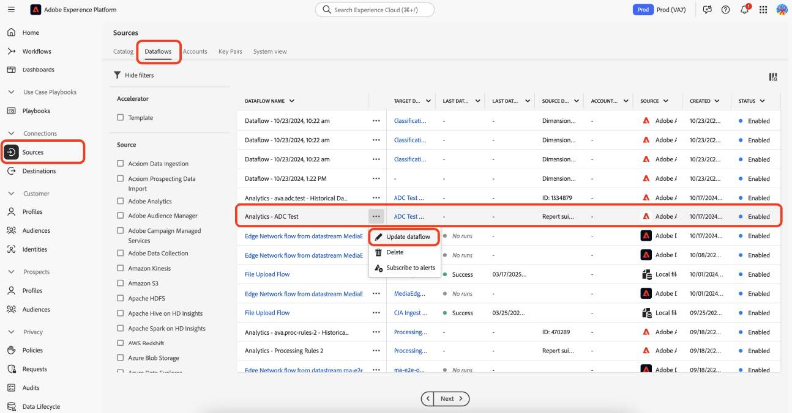

# Migrera profiler till de nya direktuppspelade mediefälten

I det här dokumentet beskrivs processen att migrera den profilfiltreringstjänst som finns ovanpå de Adobe Data Collection-flöden som är aktiverade för Adobe Analytics för direktuppspelande mediedata. Migreringen konverterar profilfiltreringstjänsten från att använda datatypen &quot;Media&quot; för Adobe direktuppspelande medietjänster till den nya motsvarande datatypen &quot;[Information om medierapportering](https://experienceleague.adobe.com/sv/docs/experience-platform/xdm/data-types/media-reporting-details)&quot;.

## Migrera profiler

Om du vill migrera profilfiltreringen från den gamla datatypen Media till den nya datatypen [Information om medierapportering](https://experienceleague.adobe.com/sv/docs/experience-platform/xdm/data-types/media-reporting-details) måste du redigera de befintliga profilfiltreringsreglerna:

1. Gå till fliken [!UICONTROL **Dataflöden**] under avsnittet [!UICONTROL **Källor**] i Adobe Experience Platform.

1. Leta reda på det dataflöde som ligger till grund för importen av strömmande mediedata från Adobe Analytics till Adobe Experience Platform via Adobe Data Collection.

1. Välj [!UICONTROL **Uppdatera dataflöde**] om du vill ändra inställningarna för profilfiltrering genom att ersätta alla anpassade regler som innehåller ett inaktuellt fält med det nya motsvarande fältet från det nya XDM-objektet.

1. Leta reda på filtren som innehåller fält från det ersatta Media-objektet.

1. Lägg till dessa filter genom att lägga till fält från det nya Media Reporting Details-objektet.

1. Använd en OR-operator mellan de två fälten,

1. Verifiera att profilerna fortfarande fungerar som förväntat.

Se parametern [Innehålls-ID](https://experienceleague.adobe.com/sv/docs/media-analytics/using/implementation/variables/audio-video-parameters#content-id) på sidan [Ljud- och videoparametrar](https://experienceleague.adobe.com/sv/docs/media-analytics/using/implementation/variables/audio-video-parameters) för att mappa mellan de gamla och de nya fälten. Den gamla fältsökvägen finns under egenskapen XDM-fältsökväg medan den nya fältsökvägen finns under egenskapen Reporting XDM-fältsökväg.

## Exempel

För att göra det enklare att följa riktlinjerna för migrering bör du ta följande exempel på dataflöde som innehåller en enda profilfiltreringsregel. I det här fallet behöver du bara tillämpa riktlinjerna för migrering en gång eftersom det bara finns en regel.

1. Gå till fliken [!UICONTROL **Dataflöden**] under avsnittet [!UICONTROL **Källor**] i Adobe Experience Platform.

&#x200B;1. Leta upp det dataflöde som ligger till grund för importen av strömmande mediedata från Adobe Analytics till Adobe Experience Platform via Adobe Analytics.

1. Välj **[!UICONTROL Update dataflow]** om du vill ange det redigeringsgränssnitt som visas i bilden nedan.

   

1. Välj **[!UICONTROL Next]** om du vill gå till fliken Filtrering.

   

1. Identifiera filtreringsreglerna som är beroende av **[!UICONTROL Filtering]**-fält på fliken `media.mediaTimed`.

   

   För varje filter som använder objektet meda.mediaTimed söker du efter dess korrespondent i objektet `mediaReporting` med hjälp av sidan [ Ljud- och videoparametrar ](https://experienceleague.adobe.com/sv/docs/media-analytics/using/implementation/variables/audio-video-parameters) för att mappa mellan de gamla fälten och de nya fälten. Den gamla fältsökvägen finns under egenskapen XDM-fältsökväg medan den nya fältsökvägen finns under egenskapen Reporting XDM-fältsökväg. För [Media Starts](https://experienceleague.adobe.com/sv/docs/media-analytics/using/implementation/variables/audio-video-parameters#media-starts) är motsvarande för `media.mediaTimed.impressions.value` till exempel `mediaReporting.sessionDetails.isViewed`.

   

1. Dra det relevanta `mediaReporting`-fältet till filtreringsregeln och använd operatorn OR mellan de två reglerna. Lägg till samma regel som den befintliga när du använder det nya fältet.

   

1. Välj **[!UICONTROL Next]** om du vill spara ändringarna.
